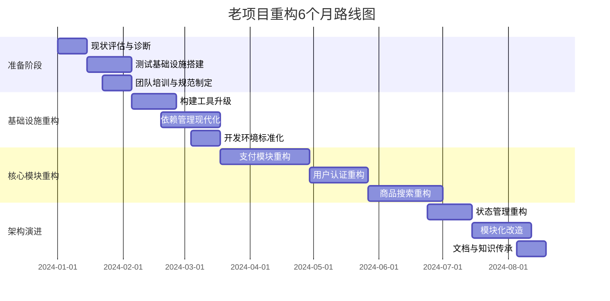

## JavaScript (6题)

1. JavaScript中的Set和Array有什么区别？什么场景下使用Set更合适？如何实现数组去重？

2. 什么是函数式编程？纯函数的概念是什么？Immutable.js解决了什么问题？

3. JavaScript中的Symbol类型有什么作用？它的应用场景有哪些？

4. 解释JavaScript中的暂时性死区（Temporal Dead Zone），let和const的区别是什么？

5. 什么是迭代器（Iterator）和可迭代对象（Iterable）？如何实现一个自定义的可迭代对象？

6. 手写实现一个完整的防抖函数，要求支持立即执行和取消功能。

## React (6题)

7. React的diff算法具体是如何工作的？单节点diff和多节点diff有什么不同？

8. Portal在React中的作用是什么？它的使用场景有哪些？如何实现一个Modal组件？

9. React中的ref有哪些使用方式？useRef和createRef的区别是什么？forwardRef的作用是什么？

10. 什么是React的并发模式（Concurrent Mode）？它带来了哪些变化？

11. React中如何实现组件的按需加载？React.lazy的原理是什么？fallback组件如何设计？

12. 自定义Hook的设计原则是什么？如何设计一个通用的useRequest Hook来处理异步请求？

## Next.js (4题)

13. Next.js的SSR、SSG、ISR分别是什么？它们的使用场景有什么区别？

14. Next.js 13+的App Router和Pages Router有什么区别？Server Components的优势是什么？

15. Next.js中的数据获取方法有哪些？getServerSideProps、getStaticProps、getStaticPaths的区别和使用场景是什么？

16. Next.js中如何实现API路由？如何处理中间件？动态路由是如何工作的？

## 性能优化 (5题)

17. 什么是渐进式渲染？骨架屏的实现方案有哪些？如何提升用户体验？

18. 前端如何进行大数据量的渲染优化？时间分片的原理是什么？

19. 浏览器的渲染流程是怎样的？从输入URL到页面展示经历了哪些步骤？

20. 什么是白屏时间和首屏时间？如何准确统计这些性能指标？

21. HTTP/2相比HTTP/1.1有哪些改进？多路复用是如何工作的？对前端性能有什么影响？

## 缓存 (3题)

22. 前端路由缓存策略有哪些？如何在React中实现页面级别的缓存（keep-alive）？

23. 什么是协商缓存的304状态码？它是如何工作的？与200 from cache有什么区别？

24. 如何实现一个带过期时间的localStorage封装？需要考虑哪些边界情况？

## 工程化 (4题)

25. Webpack的Loader和Plugin有什么区别？如何编写一个自定义Loader？

26. Tree Shaking的原理是什么？sideEffects字段的作用是什么？如何优化Tree Shaking效果？

27. 前端项目的环境变量管理方案有哪些？开发、测试、生产环境如何区分配置？

28. 如何实现前端的灰度发布？A/B测试的实现方案有哪些？

## 场景题 (2题)

29. 你需要开发一个在线视频会议系统，支持多人视频通话、屏幕共享、实时聊天、白板功能。你会选择什么技术方案？如何保证音视频的同步和低延迟？需要考虑哪些性能和兼容性问题？
我将为您提供一个全面的在线视频会议系统技术方案，涵盖架构设计、技术选型、同步优化和兼容性考虑。

## 一、技术方案选型

### 核心架构设计
```
SFU（选择性转发单元）架构 + WebRTC + 信令服务器
```
- **SFU模式**：更适合多人会议，服务器转发而不重新编码，降低延迟
- **混合架构**：小规模会议使用P2P，超过4人自动切换到SFU

### 前端技术栈
```javascript
// 主要技术选型
1. **视频通信核心**: WebRTC API + 适配层(adapter.js)
2. **框架**: React 18 + TypeScript (组件化开发)
3. **状态管理**: Zustand/Recoil (轻量级状态管理)
4. **UI组件库**: Ant Design/MUI + Tailwind CSS
5. **实时通信**: 
   - 信令: Socket.io (兼容性更好)
   - 数据通道: WebRTC DataChannel (白板、聊天)
6. **屏幕共享**: getDisplayMedia API + 画质优化
7. **白板**: Fabric.js/Konva + 操作序列化同步
8. **构建工具**: Vite + Webpack
```

### 后端技术栈
```yaml
1. **信令服务器**: Node.js + Socket.io + Redis
   - 房间管理、用户状态、SDP交换
   
2. **媒体服务器** (SFU):
   - 选项A: mediasoup (高性能，C++底层)
   - 选项B: Janus Gateway (功能全面)
   - 选项C: 自研基于Pion/WebRTC-go
   
3. **TURN/STUN服务器**: 
   - Coturn (ICE穿透，NAT穿越)
   
4. **业务服务器**: 
   - Go/Node.js + gRPC
   - MySQL/PostgreSQL (用户数据)
   - Redis (会话缓存、房间状态)
   
5. **监控告警**:
   - Prometheus + Grafana
   - ELK Stack (日志分析)
```

## 二、音视频同步与低延迟保障

### 1. 网络层优化
```javascript
// WebRTC配置优化
const peerConnectionConfig = {
  iceServers: [
    { urls: 'stun:stun.l.google.com:19302' },
    { 
      urls: 'turn:your-turn-server.com',
      credential: 'xxx',
      username: 'xxx'
    }
  ],
  
  // 关键优化参数
  iceTransportPolicy: 'all', // 同时尝试UDP和TCP
  bundlePolicy: 'max-bundle', // 减少连接数
  rtcpMuxPolicy: 'require',
  
  // 带宽估计和拥塞控制
  sdpSemantics: 'unified-plan',
  iceCandidatePoolSize: 10
};
```

### 2. 音视频同步策略
```javascript
// 同步机制实现
class AVSyncController {
  constructor() {
    this.audioBaseTime = 0;
    this.videoBaseTime = 0;
    this.syncThreshold = 50; // ms
  }
  
  // 使用RTP时间戳和NTP时间映射
  syncUsingRTCP(report) {
    // 根据RTCP SR包计算时钟偏差
    // 动态调整播放缓冲区
  }
  
  // 主从同步模式
  setSyncLeader(userId) {
    // 指定一个用户作为同步源
    // 其他客户端以其为基准调整
  }
  
  // 自适应缓冲区
  adjustJitterBuffer(networkCondition) {
    // 根据网络状况动态调整
  }
}
```

### 3. 延迟优化方案
| 优化方向 | 具体措施 | 目标延迟 |
|---------|---------|---------|
| **采集端** | 硬件加速编码、动态分辨率调整 | < 50ms |
| **传输端** | QUIC协议、FEC前向纠错 | < 100ms |
| **服务端** | 边缘节点部署、智能路由 | < 50ms |
| **播放端** | 低延迟渲染、预测解码 | < 50ms |

**总延迟控制目标**：端到端 < 200ms

### 4. QoS质量保障
```javascript
// 质量监控和自适应
class QualityManager {
  monitor() {
    // 关键指标监控
    const metrics = {
      rtt: this.getRTT(),          // 往返时延
      packetLoss: this.getLossRate(), // 丢包率
      jitter: this.getJitter(),    // 抖动
      bitrate: this.getBitrate(),  // 当前码率
      framerate: this.getFPS()     // 帧率
    };
    
    // 自适应调整策略
    this.adapt(metrics);
  }
  
  adapt(metrics) {
    if (metrics.packetLoss > 5%) {
      // 降低分辨率、开启FEC
      this.reduceBitrate(20%);
      this.enableFEC();
    }
    
    if (metrics.rtt > 300) {
      // 切换到TCP模式
      this.switchToTCP();
    }
  }
}
```

## 三、性能与兼容性考虑

### 1. 性能优化策略
```javascript
// 前端性能优化
const performanceOptimizations = {
  // 1. 视频渲染优化
  videoRendering: {
    useOffscreenCanvas: true, // 离屏渲染
    lazyLoad: true,           // 非活跃用户延迟加载
    viewportBased: true,      // 只渲染可见区域
    maxSimultaneousStreams: 4 // 限制同时解码数
  },
  
  // 2. 内存管理
  memoryManagement: {
    autoDispose: true,        // 自动释放不用的流
    cacheSize: 5,             // 缓存最近5个用户
    workerThread: true        // Web Worker处理编解码
  },
  
  // 3. CPU优化
  cpuOptimization: {
    dynamicFrameRate: true,   // 动态帧率
    backgroundThrottle: true, // 后台降级
    hardwareAcceleration: true // 硬件加速
  }
};
```

### 2. 兼容性处理
```javascript
// 浏览器兼容性方案
class CompatibilityLayer {
  constructor() {
    this.browser = this.detectBrowser();
    this.applyPatches();
  }
  
  detectBrowser() {
    // 识别浏览器和版本
    return {
      name: 'chrome',
      version: 96,
      webrtcSupport: this.checkWebRTC()
    };
  }
  
  applyPatches() {
    // Safari特殊处理
    if (this.browser.name === 'safari') {
      this.patchSafariConstraints();
      this.enableSimulcastWorkaround();
    }
    
    // 旧版Edge处理
    if (this.browser.name === 'edge' && this.browser.version < 79) {
      this.loadLegacyAdapter();
    }
    
    // 移动端优化
    if (this.isMobile()) {
      this.optimizeForMobile();
    }
  }
  
  optimizeForMobile() {
    // 移动端特定优化
    // - 降低分辨率
    // - 使用H.264基线配置
    // - 减少数据通道使用
  }
}
```

### 3. 具体兼容性策略表
| 浏览器/平台 | 适配策略 | 降级方案 |
|------------|---------|---------|
| **Chrome 60+** | 完整功能支持 | - |
| **Firefox 68+** | 调整SDP格式 | 关闭部分高级功能 |
| **Safari 13+** | Unified-Plan适配 | 限制同时流数量 |
| **iOS Safari** | 硬件编码限制 | 使用H.264，降低分辨率 |
| **Android Chrome** | 支持WebRTC | 处理权限获取差异 |
| **旧版Edge** | 加载polyfill | 回退到HLS直播模式 |
| **微信浏览器** | 受限模式 | 引导用户使用系统浏览器 |

### 4. 扩展功能实现

#### 白板功能设计
```javascript
class WhiteboardEngine {
  constructor() {
    this.canvas = new Fabric.Canvas();
    this.operationQueue = [];
    this.syncService = new OperationSync();
  }
  
  // 操作同步（CRDT算法避免冲突）
  async syncOperation(op) {
    // 1. 本地应用
    this.applyOperation(op);
    
    // 2. 通过DataChannel广播
    await this.syncService.broadcast({
      type: 'draw',
      data: op,
      timestamp: Date.now(),
      userId: this.userId,
      vectorClock: this.clock.increment()
    });
    
    // 3. 冲突解决
    this.resolveConflicts();
  }
  
  // 性能优化：只同步操作指令，不传输图片数据
}
```

#### 屏幕共享优化
```javascript
// 屏幕共享的高级配置
const screenShareConfig = {
  // 高质量配置
  highQuality: {
    frameRate: { ideal: 15, max: 30 },
    width: { ideal: 1920, max: 1920 },
    height: { ideal: 1080, max: 1080 },
    bitrate: 5000 // kbps
  },
  
  // 低带宽配置
  lowBandwidth: {
    frameRate: 10,
    width: 1280,
    height: 720,
    scalabilityMode: 'L1T3' // SVC可伸缩编码
  },
  
  // 动态切换逻辑
  dynamicSwitch(networkCondition) {
    if (networkCondition === 'poor') {
      return this.lowBandwidth;
    }
    return this.highQuality;
  }
};
```

## 四、部署架构

```yaml
部署架构:
  边缘层:
    - 全球多个TURN服务器节点
    - CDN静态资源分发
    
  区域中心:
    - SFU媒体服务器集群 (K8s部署)
    - 信令服务器集群
    
  中心云:
    - 用户数据库
    - 录制存储
    - 分析服务
    
负载均衡策略:
  - 地理就近接入
  - 服务器健康检查
  - 自动故障转移
  
监控体系:
  - 实时质量监控 (WebRTC stats)
  - 用户行为分析
  - 自动扩缩容机制
```

## 五、安全考虑

1. **传输安全**：DTLS-SRTP加密媒体流
2. **身份验证**：JWT Token + OAuth 2.0
3. **房间安全**：密码保护、主持人控制
4. **数据安全**：端到端加密选项
5. **合规性**：GDPR、CCPA数据保护

## 总结建议

1. **MVP阶段**：先实现基于P2P的4人以下会议，快速验证
2. **扩展阶段**：引入SFU支持大规模会议
3. **优化阶段**：细化QoS策略，完善监控
4. **迭代重点**：移动端体验、弱网优化、安全性增强

这个方案平衡了性能、兼容性和开发成本，可根据实际需求灵活调整。建议使用成熟的媒体服务器如mediasoup或Janus，避免从零实现WebRTC服务端逻辑。

30. 假设你要重构一个有5年历史的老项目，代码混乱、技术栈老旧、没有单元测试。你会如何制定重构计划？从哪里开始？如何保证重构过程中业务不受影响？重构的优先级如何确定？
# 老项目重构：渐进式重构策略与实施计划

## 一、重构前的准备工作

### 1. 现状评估与诊断
```javascript
// 评估矩阵
const projectAssessment = {
  // 1. 代码质量分析
  codeQuality: {
    cyclomaticComplexity: this.calculateComplexity(), // 圈复杂度 > 30
    duplicationRate: this.findDuplicates(),           // 重复代码率
    codeSmells: this.detectSmells(),                 // 坏味道数量
    dependencyGraph: this.analyzeDependencies(),      // 依赖关系图
    moduleCoupling: this.calculateCoupling()         // 模块耦合度
  },
  
  // 2. 技术栈分析
  techStack: {
    frontend: { version: 'React 15', deprecated: true },
    buildTools: { webpack: 'v2', babel: 'v6' },
    dependencies: { outdated: 85, vulnerabilities: 12 }
  },
  
  // 3. 测试覆盖
  testing: {
    unitTests: 0,
    integrationTests: 0,
    e2eTests: 0,
    manualTestCases: 125
  },
  
  // 4. 业务影响分析
  businessImpact: {
    revenueCriticalModules: ['支付', '订单', '用户中心'],
    frequentlyChangedModules: ['商品展示', '营销活动'],
    bugProneModules: ['购物车', '结算流程']
  }
};
```

### 2. 重构原则确立
```yaml
重构核心原则:
  1. 安全第一: 任何改动都不能影响线上业务
  2. 渐进式: 小步快跑，逐步替换
  3. 可验证: 每次改动都要有验证手段
  4. 可回滚: 每个步骤都必须是可逆的
  5. 价值导向: 优先重构高业务价值、高维护成本的部分
```

## 二、重构四步法

### 第一步：建立安全网（第1-2周）
```javascript
// 1. 搭建自动化测试基础设施
class TestInfrastructure {
  async setup() {
    // 关键业务路径的E2E测试
    await this.createE2ETests({
      priorityPaths: [
        '用户登录 → 浏览商品 → 加入购物车 → 支付',
        '订单查询 → 订单详情 → 物流跟踪',
        '用户注册 → 完善信息 → 首次下单'
      ],
      coverageGoal: '核心流程100%覆盖'
    });
    
    // API接口测试
    await this.createAPITests({
      criticalEndpoints: this.identifyCriticalAPIs(),
      testStrategy: '契约测试优先'
    });
    
    // 监控告警增强
    await this.enhanceMonitoring({
      businessMetrics: ['订单成功率', '支付成功率', '页面加载时间'],
      errorTracking: 'Sentry + 自定义埋点',
      alertRules: '关键指标5分钟内连续异常'
    });
  }
}
```

### 第二步：基础设施升级（第3-6周）
```javascript
// 渐进式技术栈升级策略
class InfrastructureUpgrade {
  constructor() {
    this.upgradeSequence = [
      {
        phase: '1. 构建工具升级',
        steps: [
          '保持源码不变，升级Webpack v2 → v5',
          '配置兼容性插件确保构建成功',
          '建立新老构建并行机制',
          '验证新构建产物功能一致性'
        ],
        rollbackPlan: '立即切换回旧构建配置'
      },
      {
        phase: '2. 依赖管理整理',
        steps: [
          '使用depcheck分析无用依赖',
          '按风险等级分批升级：安全补丁 → 小版本 → 大版本',
          '为每个升级创建独立PR并充分测试',
          '建立依赖更新自动化流水线'
        ]
      },
      {
        phase: '3. 开发环境现代化',
        steps: [
          '引入ESLint + Prettier统一代码风格',
          '配置Git Hooks防止坏代码入库',
          '搭建现代化开发服务器（Vite dev server）',
          '建立TypeScript渐进式迁移环境'
        ]
      }
    ];
  }
}
```

### 第三步：分层重构（第7-20周）
```javascript
// 从外向内的重构策略
class LayeredRefactoring {
  // 1. 视图层重构（风险最低）
  async refactorViewLayer() {
    // 策略：创建新组件逐步替换
    return await this.strategies.createWrapperComponents({
      approach: 'Strangler Fig Pattern',
      steps: [
        '在现有组件外层包裹新组件',
        '逐步将逻辑迁移到新组件',
        '通过A/B测试验证新组件',
        '流量逐步切换到新组件'
      ]
    });
  }
  
  // 2. 业务逻辑层提取
  async extractBusinessLogic() {
    // 识别并提取纯业务逻辑
    const businessRules = this.identifyBusinessRules({
      patterns: [
        '计算逻辑（价格计算、折扣规则）',
        '验证逻辑（表单验证、权限检查）',
        '转换逻辑（数据格式化、映射）'
      ]
    });
    
    // 创建独立服务
    return await this.createServiceLayer({
      design: 'Domain Service + Application Service',
      testStrategy: '为每个服务编写单元测试'
    });
  }
  
  // 3. 数据层重构
  async refactorDataLayer() {
    // 创建数据访问层
    return await this.createRepositoryPattern({
      currentState: 'SQL直接嵌入业务代码',
      targetState: 'Repository + Data Mapper',
      migrationSteps: [
        '创建Repository接口',
        '实现新Repository但不使用',
        '逐个替换调用点',
        '移除旧数据访问代码'
      ]
    });
  }
}
```

### 第四步：架构重塑（第21周+）
```javascript
// 逐步演进到现代架构
class ArchitectureEvolution {
  async migrateToModernArchitecture() {
    // 1. 模块化改造
    await this.createModuleBoundaries({
      strategy: 'Monorepo + 微前端准备',
      modules: [
        { name: 'user-module', scope: '用户相关功能' },
        { name: 'order-module', scope: '订单流程' },
        { name: 'product-module', scope: '商品管理' }
      ]
    });
    
    // 2. 状态管理重构
    await this.refactorStateManagement({
      current: '全局变量 + 事件总线',
      target: 'Redux Toolkit + React Query',
      migrationPath: '从局部开始，逐步替换'
    });
    
    // 3. API通信层升级
    await this.upgradeAPILayer({
      current: 'jQuery.ajax + 回调地狱',
      target: 'React Query + Axios',
      strategy: '创建API Client适配层'
    });
  }
}
```

## 三、重构优先级决策框架

```javascript
// 优先级评分模型
class RefactoringPriority {
  calculatePriority(module) {
    // 四个维度的评分（1-10分）
    const scores = {
      // 1. 业务重要性（权重40%）
      businessValue: this.scoreBusinessValue(module),
      
      // 2. 维护成本（权重30%）
      maintenanceCost: this.scoreMaintenanceCost(module),
      
      // 3. 技术风险（权重20%）
      technicalRisk: this.scoreTechnicalRisk(module),
      
      // 4. 重构收益（权重10%）
      refactoringBenefit: this.scoreRefactoringBenefit(module)
    };
    
    // 加权计算总分
    const totalScore = 
      scores.businessValue * 0.4 +
      scores.maintenanceCost * 0.3 +
      scores.technicalRisk * 0.2 +
      scores.refactoringBenefit * 0.1;
    
    return {
      module,
      totalScore,
      breakdown: scores,
      recommendation: this.getRecommendation(totalScore)
    };
  }
  
  getRecommendation(score) {
    if (score >= 8) return '立即重构（P0）';
    if (score >= 6) return '本季度重构（P1）';
    if (score >= 4) return '下季度规划（P2）';
    return '暂不重构（P3）';
  }
}

// 实际优先级排序示例
const refactoringQueue = [
  {
    module: '支付流程',
    reason: '业务核心 + 高Bug率 + 频繁改动',
    estimatedEffort: '3人周',
    risk: '高风险，需要并行运行和灰度发布'
  },
  {
    module: '用户认证',
    reason: '安全关键 + 依赖老旧库 + 单点故障',
    estimatedEffort: '2人周',
    risk: '中风险，需要无缝切换'
  },
  {
    module: '商品搜索',
    reason: '性能瓶颈 + 代码混乱 + 影响用户体验',
    estimatedEffort: '4人周',
    risk: '低风险，可以渐进式替换'
  }
];
```

## 四、保证业务不受影响的策略

### 1. 双运行机制
```javascript
// 新旧代码并行运行策略
class DualRunStrategy {
  constructor() {
    this.strategies = {
      // 策略1：功能开关
      featureFlags: {
        implementation: 'LaunchDarkly或自建开关系统',
        usage: '每个重构功能都通过开关控制',
        verification: '小流量测试 → 逐步放量 → 全量'
      },
      
      // 策略2：并行运行比较
      parallelExecution: {
        approach: '新旧实现同时运行，比较结果',
        validation: '结果一致性检查 + 性能对比',
        fallback: '结果不一致时使用旧实现并告警'
      },
      
      // 策略3：蓝绿部署
      blueGreenDeployment: {
        infrastructure: '两套独立环境',
        switchover: 'DNS切换或负载均衡器控制',
        rollback: '立即切回绿色环境'
      }
    };
  }
}
```

### 2. 验证与监控体系
```javascript
class ValidationSystem {
  // 验证金字塔
  validationPyramid = {
    level1: '单元测试（重构后立即补充）',
    level2: '集成测试（模块间接口契约）',
    level3: '端到端测试（核心业务流程）',
    level4: '监控告警（生产环境实时验证）'
  };
  
  // 生产环境验证
  productionValidation = {
    canaryRelease: '1%流量验证 → 5% → 10% → 50% → 100%',
    aBTesting: '新旧版本性能与功能对比',
    syntheticMonitoring: '定时运行关键路径脚本',
    userBehaviorAnalysis: '监控关键业务指标变化'
  };
}
```

### 3. 回滚机制
```yaml
回滚计划模板:
  触发条件:
    - 错误率 > 1% 持续5分钟
    - 关键业务指标下降 > 5%
    - 用户投诉激增
  
  回滚步骤:
    1. 立即切换功能开关到旧版本
    2. 停止新版本流量（30秒内完成）
    3. 发送告警通知相关人员
    4. 分析问题原因并记录
  
  回滚演练:
    频率: 每月一次
    场景: 模拟各种故障情况
    目标: 确保5分钟内完成回滚
```

## 五、重构计划时间表



## 六、风险管理与沟通

### 1. 风险登记册
```javascript
const riskRegistry = [
  {
    risk: '重构引入新Bug',
    probability: '中',
    impact: '高',
    mitigation: '全面测试 + 功能开关 + 渐进发布'
  },
  {
    risk: '业务需求冲突',
    probability: '高',
    impact: '中',
    mitigation: '双火车发布模式（特性火车 + 重构火车）'
  },
  {
    risk: '团队技能不足',
    probability: '中',
    impact: '中',
    mitigation: '结对编程 + 技术分享 + 外部培训'
  }
];
```

### 2. 沟通计划
```yaml
沟通矩阵:
  利益相关者:
    产品经理:
      频率: 每周同步
      内容: 重构进展、业务影响、发布时间
      
    技术团队:
      频率: 每日站会 + 每周技术评审
      内容: 技术决策、代码规范、问题解决
      
    管理层:
      频率: 每双周汇报
      内容: 投资回报率、风险状态、资源需求
      
    客户支持:
      频率: 每月培训
      内容: 新功能变化、已知问题、应急预案
```

## 七、衡量成功的指标

```javascript
// 重构成功度量指标
const successMetrics = {
  // 质量指标
  quality: {
    bugRate: '下降50%',
    testCoverage: '从0%提升到80%+',
    buildTime: '缩短60%',
    deploymentFrequency: '从每月到每日'
  },
  
  // 开发体验指标
  developerExperience: {
    onboardingTime: '从2周缩短到2天',
    buildSuccessRate: '从85%提升到99%',
    codeReviewTime: '减少40%'
  },
  
  // 业务指标
  business: {
    pageLoadTime: '提升30%',
    conversionRate: '无负面影响',
    errorRate: '下降70%'
  }
};
```

## 关键要点总结

1. **从哪开始**：从建立安全网开始，然后是基础设施，最后才是业务代码
2. **优先级**：业务价值 × 维护成本 × 技术风险，使用量化评分
3. **保证安全**：功能开关、并行运行、全面监控、快速回滚
4. **渐进式**：小步快跑，每次改动都可测试、可验证、可回滚
5. **持续沟通**：保持透明，管理期望，展示价值

**黄金法则**：在重构过程中，始终保持系统处于可发布状态，任何时候都能暂停重构，专注业务需求。
