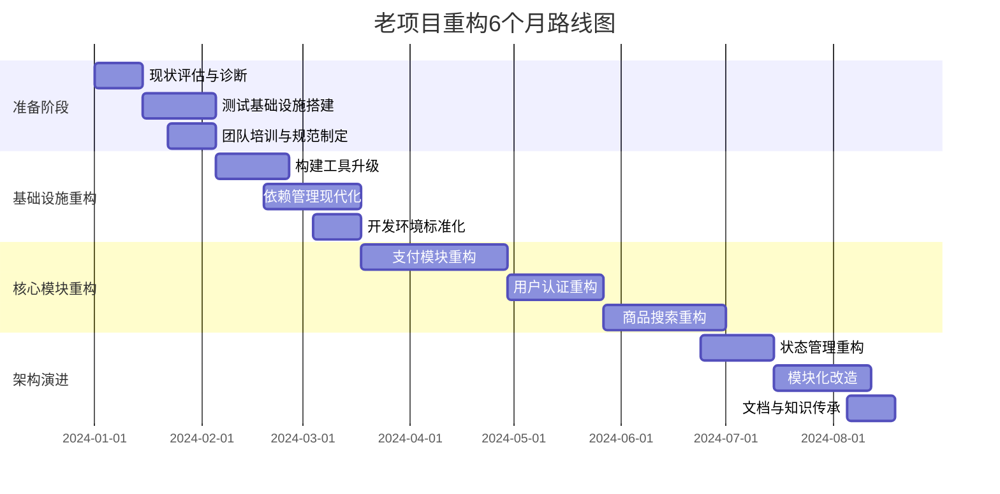

## JavaScript (6题)

1. JavaScript中的Set和Array有什么区别？什么场景下使用Set更合适？如何实现数组去重？

## 1️⃣ 数据结构层面
| 对比项    | Array         | Set         |
| ------ | ------------- | ----------- |
| 是否允许重复 | ✅ 允许          | ❌ 不允许（自动去重） |
| 是否有序   | ✅ 有序（按插入顺序）   | ✅ 有序（按插入顺序） |
| 是否有索引  | ✅ 有索引         | ❌ 没有索引      |
| 长度获取   | arr.length    | set.size    |
| 查找效率   | includes O(n) | has O(1)    |
| 主要用途   | 存储有序列表        | 存储唯一值集合     |

## 2️⃣ 核心区别总结一句话

> **Array 是有序可重复列表，Set 是无重复值集合。**

# 二、什么场景使用 Set 更合适？

### ✅ 1. 需要去重的时候

例如：

* 用户ID列表去重
* 标签去重
* 权限集合
* 已访问记录

```js
const arr = [1, 2, 2, 3];
const unique = new Set(arr);
console.log(unique); // Set(3) {1,2,3}
```

---

### ✅ 2. 高频查找判断是否存在

因为：

```js
set.has(value) // O(1)
arr.includes(value) // O(n)
```

例如：

* 判断某个ID是否在黑名单中
* 判断某个权限是否存在
* 判断某个节点是否访问过（图算法）

```js
const visited = new Set();

if (!visited.has(node)) {
  visited.add(node);
}
```

在大数据量下性能差距明显。

---

### ✅ 3. 需要保证数据唯一性

比如：

* 选中的标签集合
* 多选框结果
* 去重缓存

---

# 三、如何实现数组去重？

这是面试高频问题，建议按“演进方式”回答。

---

## ⭐ 方式一：ES6 Set（推荐）

```js
const arr = [1, 2, 2, 3, 3];

const unique = [...new Set(arr)];

console.log(unique); // [1,2,3]
```

### 原理

1. Set 自动去重
2. 再转回数组

时间复杂度：O(n)

👉 面试最佳答案

---

## ⭐ 方式二：filter + indexOf

```js
const arr = [1,2,2,3,3];

const unique = arr.filter((item, index) => {
  return arr.indexOf(item) === index;
});
```

### 缺点

* indexOf 是 O(n)
* 总体 O(n²)

数据量大性能差

---

## ⭐ 方式三：reduce + includes

```js
const arr = [1,2,2,3];

const unique = arr.reduce((acc, cur) => {
  if (!acc.includes(cur)) {
    acc.push(cur);
  }
  return acc;
}, []);
```

也是 O(n²)

---

## ⭐ 方式四：对象哈希法（适合老环境）

```js
const arr = [1,2,2,3];

const obj = {};
const unique = [];

for (let item of arr) {
  if (!obj[item]) {
    obj[item] = true;
    unique.push(item);
  }
}
```

⚠️ 注意：

* 不能区分字符串 "1" 和 数字 1
* 不适合复杂对象

---

# 四、复杂对象数组如何去重？

Set 只能对引用去重：

```js
const arr = [{a:1},{a:1}];
console.log(new Set(arr)); 
// 还是两个，因为引用不同
```

### 解决方法：使用 Map

```js
const arr = [
  {id:1,name:'a'},
  {id:2,name:'b'},
  {id:1,name:'a'}
];

const map = new Map();

arr.forEach(item => {
  map.set(item.id, item);
});

const unique = [...map.values()];

console.log(unique);
```

适用于：

* 根据 id 去重
* 根据某字段唯一性去重

---

# 五、面试标准回答结构（推荐背诵版）

你可以这样回答：

> Set 和 Array 的主要区别在于：
>
> * Array 允许重复元素，有索引
> * Set 不允许重复元素，没有索引
> * Set 的 has 方法查找效率是 O(1)，Array 的 includes 是 O(n)
>
> 当需要保证数据唯一性或高频查找时，更适合使用 Set。
>
> 数组去重可以使用：
>
> * ES6 的 [...new Set(arr)]（推荐）
> * filter + indexOf
> * reduce
> * 或使用 Map 进行对象数组去重

---

# 六、进阶延伸（面试加分点）

### 1️⃣ Set 判断重复的规则是什么？

使用：

```
SameValueZero 算法
```

意味着：

```js
NaN === NaN // false
new Set([NaN, NaN]) // 只有一个
```

Set 可以正确处理 NaN 去重。

---

### 2️⃣ WeakSet 和 Set 区别？

* WeakSet 只能存对象
* 弱引用
* 不可遍历
* 适合存储临时对象标记

---

# 七、一句话总结

> Array 适合有序可重复数据，Set 适合唯一集合与高效查找。数组去重最推荐使用 [...new Set(arr)]。


2. 什么是函数式编程？纯函数的概念是什么？Immutable.js解决了什么问题？
这个问题在中高级前端面试里非常常见，尤其是 React、Redux 相关岗位。

### ✅ 一句话定义

> 函数式编程是一种编程范式，它强调用“函数”来组织代码，避免副作用，强调不可变数据和函数组合。

---

## 核心思想

函数式编程有几个核心原则：

### 1️⃣ 函数是一等公民

* 可以作为参数传递
* 可以作为返回值
* 可以赋值给变量

```js
function add(a, b) {
  return a + b;
}

function calc(fn, x, y) {
  return fn(x, y);
}

calc(add, 1, 2);
```

---

### 2️⃣ 纯函数（最核心概念）

（后面详细讲）

---

### 3️⃣ 不可变数据（Immutable Data）

不修改原始数据，而是返回新数据。

```js
// ❌ 不推荐（修改原数据）
arr.push(4);

// ✅ 推荐
const newArr = [...arr, 4];
```

---

### 4️⃣ 函数组合（Compose）

把多个小函数组合成一个大函数。

```js
const compose = (f, g) => x => f(g(x));
```

---

### 5️⃣ 避免副作用

副作用包括：

* 修改外部变量
* 操作 DOM
* 发请求
* 修改参数
* console.log

---

# 二、什么是纯函数？

### ✅ 定义

> 纯函数是：相同输入永远得到相同输出，且没有副作用的函数。

---

## 纯函数必须满足两个条件

### 1️⃣ 相同输入 → 相同输出

```js
function add(a, b) {
  return a + b;
}
```

✔ 纯函数

---

### 2️⃣ 没有副作用

副作用包括：

* 修改外部变量
* 修改参数
* 请求网络
* 修改 DOM

```js
let count = 0;

function add() {
  count++; // ❌ 修改外部变量
}
```

不是纯函数。

---

## 再看一个例子

```js
function push(arr, item) {
  arr.push(item);
  return arr;
}
```

❌ 不是纯函数（修改了参数）

正确写法：

```js
function push(arr, item) {
  return [...arr, item];
}
```

✔ 纯函数

---

# 三、为什么纯函数重要？

### 优点：

1. 可预测
2. 易测试
3. 易维护
4. 易并行
5. 更容易做性能优化（比如 React 的 diff）

这也是为什么：

> React + Redux 强调 reducer 必须是纯函数。

---

# 四、什么是不可变数据（Immutable）？

不可变数据就是：

> 数据一旦创建就不能被修改，只能生成新的数据。

例如：

```js
const obj = { a: 1 };

// ❌
obj.a = 2;

// ✅
const newObj = { ...obj, a: 2 };
```

---

# 五、Immutable.js 解决了什么问题？

这个是面试高频进阶问题。

---

## 1️⃣ 解决的问题：深拷贝性能问题

在 React 里：

* 如果数据是可变的
* 需要手动深拷贝
* 否则无法正确做 diff

例如：

```js
const state = {
  user: {
    name: "Tom"
  }
};
```

更新：

```js
const newState = {
  ...state,
  user: {
    ...state.user,
    name: "Jerry"
  }
};
```

如果层级很深：

* 代码复杂
* 性能差
* 容易写错

---

## 2️⃣ Immutable.js 的核心思想

使用：

> 持久化数据结构（Persistent Data Structure）

特点：

* 不修改原数据
* 结构共享（Structural Sharing）
* 只复制变更路径

---

## 举例

```js
import { Map } from 'immutable';

const map1 = Map({ a: 1, b: 2 });

const map2 = map1.set('a', 3);

console.log(map1.get('a')); // 1
console.log(map2.get('a')); // 3
```

map1 没变。

---

## 3️⃣ 它真正解决的问题

### ✅ 1. 状态不可变问题

防止误修改 state。

---

### ✅ 2. 提升性能

因为可以用：

```js
oldState === newState
```

做快速判断（引用比较）

React 可以直接判断是否更新。

---

### ✅ 3. 避免深拷贝

只更新变更路径。

---

# 六、为什么现在 Immutable.js 用得少了？

因为：

1. 学习成本高
2. API 不符合原生 JS
3. TypeScript 兼容性一般
4. Immer 更好用

---

# 七、Immer 是什么？

Immer 是：

> 使用 Proxy 实现“看起来可变，实际不可变”。

例如：

```js
import produce from "immer";

const nextState = produce(state, draft => {
  draft.user.name = "Jerry";
});
```

写法像修改原数据，但底层自动生成新数据。

---

# 八、面试标准回答结构（推荐版）

你可以这样说：

---

> 函数式编程是一种编程范式，强调函数是核心单位，避免副作用，使用纯函数和不可变数据来组织程序。
>
> 纯函数是指：相同输入永远得到相同输出，且没有副作用的函数。
>
> 不可变数据可以让程序更可预测，也方便做性能优化。
>
> Immutable.js 通过持久化数据结构解决了深拷贝成本高和状态误修改的问题，同时利用结构共享提升性能。
>
> 但现在更多项目使用 Immer 来替代 Immutable.js。

---

# 九、进阶加分点（高级前端）

如果面试官继续问：

### Q：为什么不可变数据有利于 React 性能？

答：

> 因为 React 的 shouldComponentUpdate 或 memo 本质是做浅比较（===），不可变数据可以通过引用变化快速判断是否更新。

---

# 十、一句话总结

> 函数式编程强调纯函数和不可变数据，Immutable.js 通过持久化数据结构解决深拷贝和状态管理性能问题。


3. JavaScript中的Symbol类型有什么作用？它的应用场景有哪些？
这是一个**中高级前端高频题**，很多人只会回答“唯一值、防止属性冲突”，但如果你能讲到**底层机制 + 真实业务场景 + 内置 Symbol 协议**，会非常加分。

我给你一套 **面试结构化回答方案**。

---

# 一、什么是 Symbol？

### ✅ 一句话定义

> Symbol 是 ES6 引入的一种新的原始数据类型，用来创建唯一且不可重复的值，主要用于作为对象的属性键。

---

## 基本特性

```js
const s1 = Symbol();
const s2 = Symbol();

console.log(s1 === s2); // false
```

✔ 永远唯一
✔ 不可枚举（默认）
✔ 不能与其他类型运算
✔ 不是构造函数（不能 new Symbol）

---

# 二、Symbol 的核心作用

## 1️⃣ 创建唯一值（解决命名冲突）

这是最常见用途。

```js
const key = Symbol("id");

const obj = {
  [key]: 123
};

console.log(obj[key]); // 123
```

即使别人也定义了 "id"，也不会冲突。

---

## 2️⃣ 作为对象的私有属性（伪私有）

```js
const _name = Symbol("name");

class Person {
  constructor(name) {
    this[_name] = name;
  }

  getName() {
    return this[_name];
  }
}
```

外部无法直接通过字符串访问。

⚠ 但不是完全私有，只是不会被枚举。

---

## 3️⃣ 不会被常规遍历

```js
const s = Symbol("test");

const obj = {
  [s]: 1,
  a: 2
};

console.log(Object.keys(obj)); 
// ['a']
```

Symbol 属性：

* 不会被 for...in 遍历
* 不会被 Object.keys 获取
* 不会被 JSON.stringify 序列化

需要：

```js
Object.getOwnPropertySymbols(obj)
```

---

# 三、Symbol.for 和 Symbol()

很多人只会说 Symbol 唯一，但忽略了这个。

---

## Symbol()

每次都创建新值：

```js
Symbol("a") !== Symbol("a");
```

---

## Symbol.for()

全局注册机制（Symbol 注册表）

```js
const s1 = Symbol.for("test");
const s2 = Symbol.for("test");

console.log(s1 === s2); // true
```

用于：

* 跨文件共享 Symbol
* 框架内部通信

---

# 四、Symbol 的高级应用 —— 内置 Symbol（面试加分点）

ES6 定义了很多“内置 Symbol”，用于修改语言行为。

---

## 1️⃣ Symbol.iterator

决定对象是否可迭代。

```js
const obj = {
  data: [1,2,3],
  [Symbol.iterator]() {
    let index = 0;
    const arr = this.data;
    return {
      next() {
        return index < arr.length
          ? { value: arr[index++], done: false }
          : { done: true };
      }
    };
  }
};

for (let item of obj) {
  console.log(item);
}
```

---

## 2️⃣ Symbol.toPrimitive

控制对象如何转成原始值。

```js
const obj = {
  [Symbol.toPrimitive](hint) {
    if (hint === "number") return 10;
    return "hello";
  }
};

console.log(+obj); // 10
```

---

## 3️⃣ Symbol.toStringTag

控制 Object.prototype.toString 输出。

```js
class MyClass {
  get [Symbol.toStringTag]() {
    return "MyCustomClass";
  }
}

console.log(Object.prototype.toString.call(new MyClass()));
// [object MyCustomClass]
```

---

## 4️⃣ Symbol.hasInstance

控制 instanceof 行为。

---

# 五、实际应用场景总结

---

## ✅ 1. 防止属性命名冲突

大型项目或组件库中：

```js
const INTERNAL_KEY = Symbol("internal");
```

避免用户覆盖内部属性。

---

## ✅ 2. 实现对象私有属性

在 class 中模拟私有变量（旧方案）。

现在有：

```
#privateField
```

但旧代码仍使用 Symbol。

---

## ✅ 3. 定义框架内部协议

例如：

* Redux 内部 action type
* React element 内部标识（$$typeof）
* Vue 内部标识

React 就用 Symbol 标记 element 类型：

```js
Symbol.for('react.element')
```

---

## ✅ 4. 实现可迭代对象

自定义数据结构时使用 Symbol.iterator。

---

## ✅ 5. 自定义对象行为

通过：

* Symbol.toPrimitive
* Symbol.iterator
* Symbol.match
* Symbol.split

重写语言默认行为。

---

# 六、面试标准回答结构（推荐版）

你可以这样答：

---

> Symbol 是 ES6 引入的原始数据类型，用于创建唯一值，主要作用是作为对象属性键，防止命名冲突。
>
> 它的应用场景包括：
>
> * 创建唯一属性避免冲突
> * 实现伪私有属性
> * 框架内部标识（如 React 使用 Symbol.for）
> * 自定义对象的迭代行为（Symbol.iterator）
> * 控制类型转换（Symbol.toPrimitive）
>
> 此外，Symbol.for 提供了全局注册机制，适用于跨模块共享。

# 八、一句话总结

> Symbol 用于创建唯一标识，主要解决对象属性冲突问题，同时可以通过内置 Symbol 改变 JavaScript 的默认行为。


4. 解释JavaScript中的暂时性死区（Temporal Dead Zone），let和const的区别是什么？
这个问题属于 **JavaScript 作用域与变量提升的核心考点**，在中高级前端面试里非常高频。

我给你一套清晰的答题结构：

> 先讲 TDZ 原理 → 再讲 let/const 区别 → 再讲底层机制 → 最后讲常见误区

---

# 一、什么是暂时性死区（TDZ）？

## ✅ 一句话定义

> 暂时性死区（TDZ）是指：使用 let 或 const 声明的变量，在进入作用域后到变量正式声明之前的这段时间内，变量不能被访问，否则会报错。

---

## 示例

```js
{
  console.log(a); // ❌ ReferenceError
  let a = 10;
}
```

为什么报错？

因为：

* 变量 a 已经“存在于作用域中”
* 但尚未初始化
* 访问会触发 TDZ 错误

---

## 对比 var

```js
{
  console.log(a); // undefined
  var a = 10;
}
```

var 会被提升并初始化为 undefined。

---

# 二、TDZ 的本质

很多人误以为 let 没有提升，这是错的。

### 实际情况是：

* let 和 const 也会提升
* 但不会初始化
* 在初始化之前访问会报错

执行阶段大致分为：

1. 创建阶段（变量登记）
2. 执行阶段（变量赋值）

TDZ 就是：

> 从作用域开始 → 到变量声明行之前

---

## 再看一个例子

```js
let a = 1;

function test() {
  console.log(a); // ❌ TDZ
  let a = 2;
}

test();
```

为什么报错？

因为：

* 函数内部有 let a
* 作用域内形成 TDZ
* 外部的 a 被遮蔽了

---

# 三、let 和 const 的区别

这个问题非常常见。

---

## 1️⃣ 是否允许重新赋值

```js
let a = 1;
a = 2; // ✅ 可以

const b = 1;
b = 2; // ❌ 报错
```

const 声明的变量必须初始化，且不能重新赋值。

---

## 2️⃣ 是否存在 TDZ

✔ 两者都有 TDZ。

---

## 3️⃣ 是否必须初始化

```js
let a; // ✅ 可以

const b; // ❌ 报错
```

const 必须在声明时初始化。

---

## 4️⃣ 对象是否可修改？

const 不能改“引用”，但可以改“内容”。

```js
const obj = { a: 1 };

obj.a = 2; // ✅ 可以
obj = {};  // ❌ 不可以
```

const 保证的是：

> 变量指向的内存地址不可变

不是值不可变。

---

# 四、let、const、var 全面对比

| 特性    | var              | let     | const   |
| ----- | ---------------- | ------- | ------- |
| 作用域   | 函数作用域            | 块级作用域   | 块级作用域   |
| 变量提升  | 有（初始化 undefined） | 有（未初始化） | 有（未初始化） |
| TDZ   | ❌                | ✅       | ✅       |
| 可重复声明 | ✅                | ❌       | ❌       |
| 必须初始化 | ❌                | ❌       | ✅       |
| 可重新赋值 | ✅                | ✅       | ❌       |

---

# 五、为什么要设计 TDZ？

面试加分点。

### 1️⃣ 防止变量在声明前使用

```js
console.log(x);
let x = 10;
```

如果返回 undefined：

* 逻辑错误
* 隐性 bug

TDZ 强制你先声明再使用。

---

### 2️⃣ 让块级作用域更安全

```js
for (let i = 0; i < 3; i++) {
  setTimeout(() => console.log(i), 0);
}
```

输出：

```
0
1
2
```

如果是 var，就会是：

```
3
3
3
```

---

# 六、常见面试陷阱题

---

## 1️⃣ typeof 在 TDZ 中

```js
console.log(typeof a);
let a = 1;
```

会报错，不是 undefined。

因为：

TDZ 优先级高于 typeof 的安全机制。

---

## 2️⃣ 参数默认值 TDZ

```js
function test(a = b, b = 2) {
  console.log(a, b);
}

test(); // ❌
```

b 还未初始化，进入 TDZ。

---

# 七、面试标准回答版本

你可以这样说：

---

> 暂时性死区是指使用 let 或 const 声明的变量，在进入作用域后到声明之前不能被访问，否则会抛出 ReferenceError。
>
> let 和 const 都有变量提升，但不会初始化，因此会产生 TDZ。
>
> 两者区别在于：
>
> * const 必须初始化且不能重新赋值
> * let 可以重新赋值
> * 两者都是块级作用域
>
> TDZ 的设计目的是避免变量在声明前被误用，提高代码安全性。

---

# 八、一句话总结

> let 和 const 都有变量提升，但在初始化前处于暂时性死区；const 不可重新赋值，而 let 可以。

# 一、什么是迭代器（Iterator）？

## ✅ 一句话定义

> 迭代器是一个对象，它定义了一种按顺序访问集合元素的标准方式。

---

## 迭代器必须满足什么？

一个迭代器对象必须有：

```js
next()
```

并且返回：

```js
{
  value: 任意值,
  done: 布尔值
}
```

---

## 示例：最简单的迭代器

```js
function createIterator(arr) {
  let index = 0;

  return {
    next() {
      if (index < arr.length) {
        return {
          value: arr[index++],
          done: false
        };
      } else {
        return {
          value: undefined,
          done: true
        };
      }
    }
  };
}

const it = createIterator([1, 2, 3]);

console.log(it.next()); // {value:1, done:false}
console.log(it.next()); // {value:2, done:false}
console.log(it.next()); // {value:3, done:false}
console.log(it.next()); // {value:undefined, done:true}
```

---

# 二、什么是可迭代对象（Iterable）？

## ✅ 一句话定义

> 可迭代对象是指实现了 `Symbol.iterator` 方法的对象。

---

## 本质条件

对象必须实现：

```js
obj[Symbol.iterator]
```

并且这个方法必须返回一个“迭代器对象”。

---

## 内置可迭代对象

以下都是可迭代的：

* Array
* String
* Map
* Set
* arguments
* NodeList

因为它们内部实现了：

```js
Symbol.iterator
```

---

# 三、Iterator 和 Iterable 的关系

很多人混淆这个。

### 关系是：

> Iterable 负责生成 Iterator
> Iterator 负责遍历数据

可以理解为：

* Iterable = 工厂
* Iterator = 工作机器

---

# 四、for...of 是怎么工作的？

执行：

```js
for (const item of obj) {}
```

底层做了什么？

1. 调用 `obj[Symbol.iterator]()`
2. 获取 iterator
3. 循环调用 iterator.next()
4. 直到 done = true

---

# 五、如何实现一个自定义可迭代对象？

这是面试重点。

---

## 方法一：手写 Symbol.iterator

### 示例：自定义一个范围对象

```js
const range = {
  start: 1,
  end: 5,

  [Symbol.iterator]() {
    let current = this.start;
    let end = this.end;

    return {
      next() {
        if (current <= end) {
          return {
            value: current++,
            done: false
          };
        } else {
          return {
            done: true
          };
        }
      }
    };
  }
};

for (const num of range) {
  console.log(num);
}
```

输出：

```
1
2
3
4
5
```

---

## 方法二：使用 Generator（推荐）

Generator 本质就是 Iterator 生成器。

```js
const range = {
  start: 1,
  end: 5,

  *[Symbol.iterator]() {
    for (let i = this.start; i <= this.end; i++) {
      yield i;
    }
  }
};

for (const num of range) {
  console.log(num);
}
```

更简洁。

---

# 六、迭代协议总结

## 可迭代协议（Iterable Protocol）

对象必须实现：

```
Symbol.iterator()
```

---

## 迭代器协议（Iterator Protocol）

返回对象必须有：

```
next()
```

返回：

```
{ value, done }
```

---

# 七、面试常见追问

---

## 1️⃣ 什么情况下对象不能 for...of？

普通对象：

```js
const obj = { a: 1, b: 2 };

for (const item of obj) {} // ❌ 报错
```

因为没有 Symbol.iterator。

---

## 2️⃣ for...in 和 for...of 区别？

| for...in | for...of    |
| -------- | ----------- |
| 遍历 key   | 遍历 value    |
| 适合对象     | 适合 iterable |
| 会遍历原型链   | 不会          |

---

## 3️⃣ 展开运算符为什么只能用于可迭代对象？

```js
[...obj] // 本质调用 Symbol.iterator
```

---

## 4️⃣ Map 和 Set 为什么可以 for...of？

因为它们内部实现了：

```js
Map.prototype[Symbol.iterator]
Set.prototype[Symbol.iterator]
```

---

# 八、面试标准回答模板

你可以这样回答：

---

> 迭代器是一种标准的遍历机制，它是一个具有 next 方法的对象，每次调用 next 返回 { value, done }。
>
> 可迭代对象是实现了 Symbol.iterator 方法的对象，该方法返回一个迭代器。
>
> for...of、展开运算符、解构赋值都基于迭代协议。
>
> 实现一个自定义可迭代对象，只需要在对象上定义 Symbol.iterator 方法，并返回一个符合迭代器协议的对象，或者使用 Generator 简化实现。

---

# 九、一句话总结

> Iterable 定义如何生成 Iterator，Iterator 定义如何按顺序访问数据。


6. 手写实现一个完整的防抖函数，要求支持立即执行和取消功能。
这是一个**高频手写题**，如果你能写出：

* ✅ 支持 `immediate` 立即执行
* ✅ 支持 `cancel()` 取消
* ✅ 正确处理 `this`
* ✅ 正确处理参数
* ✅ 多次触发逻辑正确

基本可以算合格甚至加分。

---

# 一、需求分析

防抖（debounce）的行为是：

> 在事件持续触发时，只在停止触发一段时间后执行一次。

支持功能：

1. 普通防抖
2. 立即执行（leading）
3. 取消功能
4. 保持 this 不丢失
5. 保持参数正确

---

# 二、完整实现（推荐标准版）

```js
function debounce(fn, delay, immediate = false) {
  let timer = null;

  function debounced(...args) {
    const context = this;

    // 如果已经有定时器，清除
    if (timer) clearTimeout(timer);

    if (immediate) {
      // 是否是第一次触发
      const callNow = !timer;

      timer = setTimeout(() => {
        timer = null;
      }, delay);

      if (callNow) {
        fn.apply(context, args);
      }
    } else {
      timer = setTimeout(() => {
        fn.apply(context, args);
      }, delay);
    }
  }

  // 取消功能
  debounced.cancel = function () {
    if (timer) {
      clearTimeout(timer);
      timer = null;
    }
  };

  return debounced;
}
```

---

# 三、使用示例

## 1️⃣ 普通防抖

```js
const fn = debounce(() => {
  console.log("执行");
}, 1000);

window.addEventListener("resize", fn);
```

---

## 2️⃣ 立即执行模式

```js
const fn = debounce(() => {
  console.log("立即执行");
}, 1000, true);
```

行为：

* 第一次立即执行
* 之后 1 秒内不执行
* 1 秒后才能再次触发

---

## 3️⃣ 取消功能

```js
const fn = debounce(() => {
  console.log("执行");
}, 1000);

fn.cancel();
```

---

# 四、逻辑解释（面试一定要讲）

### 普通模式：

```
触发 → 清除旧定时器 → 重新计时
```

只会执行最后一次。

---

### 立即执行模式：

```
第一次触发立即执行
开启一个冷却定时器
冷却结束后允许再次立即执行
```

核心判断：

```js
const callNow = !timer;
```

---

# 五、常见错误点

---

## ❌ 错误 1：this 丢失

错误写法：

```js
fn(...args);
```

正确：

```js
fn.apply(this, args);
```

---

## ❌ 错误 2：immediate 逻辑错误

很多人会写成：

```js
if (immediate) fn();
```

但会每次都执行。

必须通过：

```js
!timer
```

控制只第一次执行。

---

# 六、进阶增强版（支持返回值）

有些面试官会问：

> 如果 immediate 为 true，如何返回函数执行结果？

增强版本：

```js
function debounce(fn, delay, immediate = false) {
  let timer = null;
  let result;

  function debounced(...args) {
    const context = this;

    if (timer) clearTimeout(timer);

    if (immediate) {
      const callNow = !timer;

      timer = setTimeout(() => {
        timer = null;
      }, delay);

      if (callNow) {
        result = fn.apply(context, args);
      }
    } else {
      timer = setTimeout(() => {
        result = fn.apply(context, args);
      }, delay);
    }

    return result;
  }

  debounced.cancel = function () {
    if (timer) {
      clearTimeout(timer);
      timer = null;
    }
  };

  return debounced;
}
```

---

# 七、防抖 vs 节流（面试可能追问）

| 防抖        | 节流     |
| --------- | ------ |
| 最后一次执行    | 固定时间执行 |
| 搜索框       | 滚动监听   |
| 频繁触发只执行一次 | 固定间隔执行 |

# 八、面试标准回答结构

你可以这样回答：

> 防抖的核心思想是：事件频繁触发时，只在停止触发后一段时间执行一次。
>
> 实现上通过闭包保存 timer，每次触发时清除旧定时器。
>
> immediate 模式通过判断 timer 是否存在控制首次执行。
>
> 取消功能通过在返回函数上挂载 cancel 方法实现。

# 九、一句话总结

> 防抖的核心是利用闭包保存定时器，并在触发时重置计时。


## React (6题)

7. React的diff算法具体是如何工作的？单节点diff和多节点diff有什么不同？

8. Portal在React中的作用是什么？它的使用场景有哪些？如何实现一个Modal组件？

9. React中的ref有哪些使用方式？useRef和createRef的区别是什么？forwardRef的作用是什么？

10. 什么是React的并发模式（Concurrent Mode）？它带来了哪些变化？

11. React中如何实现组件的按需加载？React.lazy的原理是什么？fallback组件如何设计？

12. 自定义Hook的设计原则是什么？如何设计一个通用的useRequest Hook来处理异步请求？

## Next.js (4题)

13. Next.js的SSR、SSG、ISR分别是什么？它们的使用场景有什么区别？
这个问题是 **Next.js 面试必考题**，尤其是做过 SEO、B 端官网、内容平台项目的岗位。

# 一、核心概念总览

Next.js 提供三种主要的页面生成方式：

| 模式  | 全称                              | 生成时机       | 是否每次请求都执行 |
| --- | ------------------------------- | ---------- | --------- |
| SSR | Server Side Rendering           | 每次请求时      | ✅ 是       |
| SSG | Static Site Generation          | 构建时（build） | ❌ 否       |
| ISR | Incremental Static Regeneration | 构建时 + 定时再生 | ❌ 不是每次    |

---

# 二、SSR（Server Side Rendering）

## ✅ 是什么？

> 每次用户请求页面时，服务器都会实时渲染 HTML。

在 Pages Router 中使用：

```js
export async function getServerSideProps(context) {
  const data = await fetchData();
  return {
    props: { data }
  };
}
```

---

## 工作流程

```
用户请求 → 服务器请求数据 → 生成 HTML → 返回浏览器
```

---

## 优点

* 数据实时
* SEO 友好
* 适合频繁变化的数据

---

## 缺点

* 每次都执行
* 性能依赖服务器
* 并发高时压力大

---

## 适用场景

* 用户个人页面
* 实时数据页面（订单、后台系统）
* 强依赖请求参数的页面

例如：

* 用户中心
* 管理后台
* 实时行情

---

# 三、SSG（Static Site Generation）

## ✅ 是什么？

> 在构建时生成静态 HTML，之后直接使用 CDN 缓存。

在 Pages Router 中：

```js
export async function getStaticProps() {
  const data = await fetchData();
  return {
    props: { data }
  };
}
```

---

## 工作流程

```
构建时生成 HTML → 部署到 CDN → 用户直接访问静态文件
```

---

## 优点

* 极快（CDN 级别）
* 无服务器压力
* SEO 友好

---

## 缺点

* 数据不实时
* 必须重新 build 才能更新

---

## 适用场景

* 博客文章
* 官网
* 文档站
* 不频繁更新的内容

例如：

* 技术博客
* 产品介绍页
* 帮助中心

---

# 四、ISR（Incremental Static Regeneration）

这是 Next.js 的进阶特性。

---

## ✅ 是什么？

> 在 SSG 的基础上，允许页面在运行时“定期重新生成”。

使用方式：

```js
export async function getStaticProps() {
  const data = await fetchData();
  return {
    props: { data },
    revalidate: 60 // 60秒后允许重新生成
  };
}
```

---

## 工作机制

```
构建时生成页面
↓
用户访问
↓
超过 revalidate 时间后
↓
后台生成新页面（不阻塞用户）
↓
替换旧页面
```

---

## 优点

* 接近 SSG 的性能
* 数据可更新
* 不需要重新构建整个站点

---

## 缺点

* 数据不是实时
* 需要缓存机制支持

---

## 适用场景

* 电商商品页
* 新闻网站
* 内容平台
* 访问量大但更新频率可接受的页面

例如：

* 商品详情页
* 博客首页
* 分类列表页

---

# 五、三者核心区别总结

| 维度     | SSR  | SSG | ISR      |
| ------ | ---- | --- | -------- |
| 渲染时机   | 每次请求 | 构建时 | 构建时 + 定时 |
| 性能     | 一般   | 极快  | 很快       |
| 数据实时性  | 实时   | 不实时 | 准实时      |
| 服务器压力  | 高    | 低   | 低        |
| 是否需要重建 | 否    | 是   | 否        |

---

# 六、用一句话区分

* SSR：每次都现做现卖
* SSG：提前做好库存
* ISR：库存过期自动补货

---

# 七、App Router（Next13+）补充（加分点）

在 App Router 中：

* SSR → 默认 Server Component
* SSG → `fetch(..., { cache: 'force-cache' })`
* ISR → `fetch(..., { next: { revalidate: 60 } })`

---

# 八、面试标准回答模板

你可以这样说：

---

> Next.js 提供 SSR、SSG 和 ISR 三种渲染模式。
>
> SSR 是每次请求时服务器生成 HTML，适合实时数据页面。
>
> SSG 是构建时生成静态页面，适合内容稳定的页面，性能最好。
>
> ISR 是在 SSG 基础上增加定时更新机制，可以在不重新构建的情况下更新页面。
>
> 在实际项目中：
>
> * 实时性高用 SSR
> * 内容稳定用 SSG
> * 高流量且允许延迟更新用 ISR

---

# 九、进阶追问（高频）

---

## Q1：为什么 SSR SEO 好？

因为搜索引擎拿到的是完整 HTML，而不是 CSR 的空壳。

---

## Q2：ISR 为什么不会阻塞用户？

因为 Next 会：

* 先返回旧页面
* 后台生成新页面
* 下次请求使用新页面

---

## Q3：CSR 在 Next 中怎么实现？

* useEffect
* dynamic import
* client component

---

# 十、一句话总结

> SSR 实时生成，SSG 构建生成，ISR 定期更新生成。


14. Next.js 13+的App Router和Pages Router有什么区别？Server Components的优势是什么？
这个问题已经是 **中高级 / 架构岗 Next.js 必问题** 了。
如果你能讲清楚：

* App Router vs Pages Router 的本质差异
* React Server Components（RSC）到底解决什么问题
* 为什么说它是“架构级升级”

基本就是高分回答。

我帮你拆成三层结构讲清楚：

---

# 一、Pages Router vs App Router 核心区别

## 1️⃣ 路由组织方式不同

### Pages Router（旧）

基于 `pages/` 目录：

```
pages/
 ├─ index.tsx
 ├─ about.tsx
 └─ blog/[id].tsx
```

特点：

* 文件即路由
* 基于约定
* 数据获取靠：

  * getServerSideProps
  * getStaticProps
  * getInitialProps

---

### App Router（Next13+）

基于 `app/` 目录：

```
app/
 ├─ page.tsx
 ├─ layout.tsx
 ├─ blog/
 │   ├─ page.tsx
 │   └─ [id]/
 │       └─ page.tsx
```

特点：

* 支持嵌套路由
* 支持 Layout 嵌套
* 支持 Server Components
* 支持流式渲染（Streaming）
* 数据获取方式改变（直接 fetch）

---

# 2️⃣ 数据获取方式不同（非常重要）

### Pages Router

```js
export async function getServerSideProps() {
  return { props: {} }
}
```

是框架层 API。

---

### App Router

直接在组件中：

```js
async function Page() {
  const data = await fetch("...");
  return <div>{data}</div>
}
```

特点：

* fetch 默认运行在服务器
* 自动缓存
* 支持 revalidate
* 支持流式渲染

---

# 3️⃣ 默认组件类型不同

| Router       | 默认组件类型           |
| ------------ | ---------------- |
| Pages Router | Client Component |
| App Router   | Server Component |

这是最大的架构变化。

---

# 4️⃣ Layout 能力

Pages Router：

* 只能用 _app.tsx
* 不能嵌套 layout

App Router：

* 每个目录可以有 layout.tsx
* 支持嵌套布局
* 支持局部刷新

这是大型项目架构级提升。

---

# 5️⃣ 支持 Streaming（流式渲染）

App Router 支持：

```
HTML 分块返回
```

用户可以：

* 先看到页面框架
* 再看到数据

提升首屏体验。

---

# 二、Server Components 是什么？

这是重点。

---

## 1️⃣ 定义

> Server Components 是运行在服务器上的 React 组件，不会打包到浏览器。

---

## 2️⃣ 特点

* 不会发送 JS 到客户端
* 可以直接访问数据库
* 可以直接调用后端 API
* 默认支持 async/await
* 不能使用 useState/useEffect

---

# 三、Server Components 解决了什么问题？

这是面试真正想听的。

---

## 1️⃣ 减少 JS 体积（最大优势）

传统 CSR：

```
组件 + 数据获取 + 渲染逻辑 全部发送到浏览器
```

Server Component：

```
服务器渲染好 → 只发送结果
```

浏览器无需下载组件逻辑。

性能显著提升。

---

## 2️⃣ 提升首屏速度

因为：

* 不需要等待 JS 下载
* 不需要 hydrate 整棵树

---

## 3️⃣ 更安全

可以：

```js
const data = await db.query(...)
```

数据库逻辑不会暴露给客户端。

---

## 4️⃣ 减少客户端状态复杂度

不需要：

* useEffect 拉数据
* loading 状态
* 手动缓存

---

## 5️⃣ 自动缓存与数据共享

Next 13：

```js
fetch(url, { cache: 'force-cache' })
fetch(url, { next: { revalidate: 60 } })
```

内置缓存系统。

---

# 四、Client Component vs Server Component

## Client Component

必须写：

```js
"use client";
```

特点：

* 可以用 useState
* 可以用 useEffect
* 有交互能力
* 会被打包到浏览器

---

## Server Component

默认就是：

* 无交互
* 无状态
* 不打包

---

# 五、App Router 的优势总结

| 优势    | 说明                  |
| ----- | ------------------- |
| 更少 JS | 默认 Server Component |
| 更快首屏  | 减少 hydration        |
| 更强路由  | 嵌套 layout           |
| 支持流式  | 更好用户体验              |
| 内置缓存  | 减少重复请求              |
| 架构更现代 | React 18 深度整合       |

---

# 六、面试标准回答模板

你可以这样回答：

---

> Pages Router 是基于 pages 目录的传统文件路由方式，数据获取通过 getServerSideProps 等 API。
>
> App Router 是 Next13 引入的新架构，基于 app 目录，支持嵌套路由和 layout，并且默认使用 React Server Components。
>
> 最大的区别是：App Router 默认是 Server Components，组件在服务器运行，不会发送到客户端，从而减少 JS 体积，提高首屏性能。
>
> Server Components 的优势包括：
>
> * 减少客户端 JS
> * 更快首屏加载
> * 支持直接访问数据库
> * 更安全
> * 内置缓存和流式渲染能力

---

# 七、一句话总结

> Pages Router 是传统 CSR/SSR 架构，App Router 是基于 Server Components 的现代混合渲染架构。

---

# 八、面试高阶追问（准备好）

---

### Q：Server Components 为什么不能用 useState？

因为它运行在服务器，不存在浏览器状态。

---

### Q：Server Component 如何嵌套 Client Component？

可以在 Server Component 中引入 Client Component。

---

### Q：RSC 和 SSR 区别？

SSR：

* 渲染 HTML
* JS 仍然会发送到客户端

RSC：

* 组件逻辑都不发送


15. Next.js中的数据获取方法有哪些？getServerSideProps、getStaticProps、getStaticPaths的区别和使用场景是什么？

16. Next.js中如何实现API路由？如何处理中间件？动态路由是如何工作的？

## 性能优化 (5题)

17. 什么是渐进式渲染？骨架屏的实现方案有哪些？如何提升用户体验？
这个问题是 **性能优化 + 用户体验（UX）** 的高频面试题，常见于中高级前端或偏体验方向的岗位。

建议回答结构：

> 先讲什么是渐进式渲染 → 再讲骨架屏实现方案 → 再讲整体用户体验优化策略

---

# 一、什么是渐进式渲染（Progressive Rendering）？

## ✅ 一句话定义

> 渐进式渲染是指：页面内容不是一次性全部加载完成再展示，而是分阶段逐步展示，让用户尽早看到有意义的内容。

---

## 为什么需要渐进式渲染？

如果页面：

* 首屏加载慢
* 数据请求多
* JS 包体积大

用户会看到：

```
白屏 2~3 秒
```

体验非常差。

渐进式渲染目标：

```
尽早可见 + 分阶段加载 + 减少感知等待时间
```

---

## 常见方式

### 1️⃣ 分块加载（Chunk）

* Code Splitting
* 动态 import
* React.lazy

---

### 2️⃣ 流式渲染（Streaming）

例如：

* Next.js 13 Streaming
* SSR 分块返回 HTML

浏览器：

* 先渲染 header
* 再渲染主体
* 再渲染数据部分

---

### 3️⃣ 占位加载（Loading Placeholder）

比如：

* 骨架屏
* loading spinner
* 进度条

---

### 4️⃣ 图片渐进加载

* 先展示模糊图
* 再加载高清图

---

# 二、什么是骨架屏（Skeleton Screen）？

## ✅ 一句话定义

> 骨架屏是在内容加载完成前，使用页面结构的占位灰色块来模拟最终布局。

比 loading 更友好，因为：

* 用户能感知页面结构
* 觉得页面在加载，而不是卡住

---

# 三、骨架屏实现方案有哪些？

分为三种主流方式。

---

# 方案一：纯 CSS 手写骨架屏

## 基本实现

```html
<div class="skeleton"></div>
```

```css
.skeleton {
  width: 100%;
  height: 20px;
  background: #eee;
  border-radius: 4px;
  position: relative;
  overflow: hidden;
}

.skeleton::after {
  content: "";
  position: absolute;
  top: 0;
  left: -100%;
  width: 100%;
  height: 100%;
  background: linear-gradient(
    90deg,
    transparent,
    rgba(255,255,255,0.4),
    transparent
  );
  animation: shimmer 1.5s infinite;
}

@keyframes shimmer {
  100% {
    left: 100%;
  }
}
```

效果：

```
灰色块 + 闪动动画
```

---

优点：

* 无依赖
* 可控性强
* 轻量

缺点：

* 需要手写布局

---

# 方案二：组件库实现

例如：

* antd Skeleton
* MUI Skeleton
* Element Skeleton

使用简单：

```jsx
<Skeleton active paragraph={{ rows: 3 }} />
```

优点：

* 快速集成
* 风格统一

缺点：

* 可能样式不完全匹配真实布局

---

# 方案三：自动生成骨架屏（工程化）

例如：

* 构建阶段生成
* puppeteer 抓取页面结构
* 将页面转成骨架 HTML

常见于：

* 大型官网
* 电商平台

---

# 四、骨架屏 vs Loading 的区别

| Loading   | 骨架屏    |
| --------- | ------ |
| 一个转圈      | 模拟页面结构 |
| 用户不知道加载什么 | 用户知道结构 |
| 感知等待长     | 感知等待短  |

骨架屏本质是：

> 减少用户的心理焦虑

---

# 五、如何真正提升用户体验？

面试加分点在这里。

---

## 1️⃣ 提升“感知性能”而不是只优化性能

用户体验 = 感知时间

例如：

* 提前展示 header
* 优先加载关键内容
* 懒加载非关键内容

---

## 2️⃣ 使用优先级加载

```html
<link rel="preload">
```

Next.js：

```js
priority
```

---

## 3️⃣ 减少 CLS（布局偏移）

* 图片提前占位
* 固定宽高

---

## 4️⃣ 使用 Suspense

```jsx
<Suspense fallback={<Skeleton />}>
  <UserList />
</Suspense>
```

实现分块加载。

---

## 5️⃣ 使用 ISR / 缓存

减少请求时间。

---

## 6️⃣ 图片优化

* WebP
* AVIF
* 懒加载
* CDN

---

## 7️⃣ 合理的 loading 反馈

不同场景用不同方式：

* 表单提交 → loading button
* 页面加载 → 骨架屏
* 短请求 → 无 loading

---

# 六、面试标准回答模板

你可以这样回答：

---

> 渐进式渲染是指将页面内容分阶段加载和展示，尽早让用户看到可用内容，减少白屏时间。
>
> 骨架屏是一种常见的渐进式渲染方式，它用灰色占位块模拟页面结构，比传统 loading 更能提升用户感知体验。
>
> 骨架屏的实现方式包括：
>
> * 纯 CSS 实现
> * 使用组件库
> * 构建阶段自动生成
>
> 提升用户体验不仅是优化性能指标，还包括：
>
> * 优先加载关键资源
> * 减少布局偏移
> * 使用缓存
> * 合理使用 Suspense
> * 图片优化

---

# 七、一句话总结

> 渐进式渲染的核心目标是提升“感知性能”，骨架屏是最常见的实现方式之一。

18. 前端如何进行大数据量的渲染优化？时间分片的原理是什么？
这题是**中高级前端性能优化高频题**，尤其你做 React 项目，这题很容易被深挖。

它本质考察：

* 浏览器渲染机制
* 主线程模型
* 任务调度
* React Fiber 思想

我给你一套**结构化 + 可深可浅的面试回答** 👇

---

# 一、前端大数据量渲染的核心问题是什么？

一句话：

> 主线程被长时间占用，导致页面卡顿。

因为浏览器是：

```
单线程 + 事件循环
```

如果一次性渲染 10 万条 DOM：

* JS 执行时间过长
* 渲染阻塞
* 页面无法响应输入
* 掉帧

---

# 二、大数据量渲染优化方案

可以分成 4 类。

---

# ① 虚拟列表（最核心方案）

适用于：

* 长列表
* 表格
* 聊天记录

核心思想：

> 只渲染可视区域的 DOM

例如：

```
100000 条数据
屏幕只能看到 20 条
→ 只渲染 20 条
```

技术实现：

* 监听 scroll
* 计算 startIndex
* 通过 transform 偏移

常用库：

* react-window
* react-virtualized

优点：

* DOM 数量稳定
* 性能极好

---

# ② 分批渲染（时间分片）

如果不能虚拟滚动（比如瀑布流），可以：

> 分多次渲染，而不是一次渲染全部

例如：

```js
function renderChunk(data) {
  const chunkSize = 100
  let index = 0

  function loop() {
    const end = Math.min(index + chunkSize, data.length)

    for (; index < end; index++) {
      renderItem(data[index])
    }

    if (index < data.length) {
      requestIdleCallback(loop)
    }
  }

  loop()
}
```

---

# ③ 使用 requestAnimationFrame

适合动画型批量更新：

```js
function render() {
  requestAnimationFrame(() => {
    // 执行一部分任务
  })
}
```

保证：

* 不阻塞下一帧
* 保持 60fps

---

# ④ Web Worker

如果是：

* 大量计算
* 排序
* 复杂数据处理

可以把计算放到 Worker。

注意：

> Worker 不能操作 DOM。

---

# ⑤ 减少 DOM 操作次数

使用：

* DocumentFragment
* 批量插入
* 减少回流重绘

例如：

```js
const fragment = document.createDocumentFragment()
```

---

# 三、时间分片的原理是什么？

这是核心。

时间分片（Time Slicing）本质是：

> 把长任务拆成多个小任务，在浏览器空闲时执行。

---

## 为什么要时间分片？

浏览器 60fps：

```
一帧时间 ≈ 16.6ms
```

如果 JS 执行超过 16ms：

→ 掉帧

所以目标是：

> 每次执行不要超过 16ms。

---

## 时间分片的实现原理

利用：

* requestIdleCallback
* requestAnimationFrame
* MessageChannel
* setTimeout(0)

---

## 1️⃣ requestIdleCallback 原理

浏览器会在：

* 一帧渲染结束
* 有空闲时间

调用：

```js
requestIdleCallback((deadline) => {
  while (deadline.timeRemaining() > 0) {
    // 执行任务
  }
})
```

核心：

```
deadline.timeRemaining()
```

表示本帧剩余可用时间。

---

## 2️⃣ React Fiber 的时间分片思想

React 16 之前：

* 递归同步渲染
* 不可中断

React Fiber：

* 把渲染拆成小单元
* 可中断
* 可恢复

本质：

> 链表结构 + cooperative scheduling

Fiber 工作循环：

```
执行一部分 → 判断是否超时 → 如果超时 → 让出主线程
```

---

## 3️⃣ 简单时间分片示例

```js
function timeSlice(tasks) {
  function run() {
    const start = performance.now()

    while (tasks.length && performance.now() - start < 5) {
      tasks.shift()()
    }

    if (tasks.length) {
      setTimeout(run)
    }
  }

  run()
}
```

核心思想：

```
限制单次执行时间
```

---

# 四、面试可以这样总结

你可以说：

> 大数据量渲染的核心问题是主线程阻塞。
> 常见优化方式包括虚拟列表、分批渲染、时间分片、Web Worker 和减少 DOM 操作。
>
> 时间分片的原理是把长任务拆成多个小任务，在每一帧空闲时间执行，从而避免阻塞渲染线程。
> React Fiber 的核心思想也是基于时间分片，实现可中断渲染。

---

# 五、面试官可能继续追问

常见追问：

* requestIdleCallback 和 setTimeout 区别？
这题是**浏览器调度机制 + 性能优化**高频题，尤其和你前面问的“时间分片”“大数据渲染”是强关联的。

我给你一套结构化回答：

1. ✅ 基本区别
2. ✅ 事件循环层面区别
3. ✅ 执行时机对比
4. ✅ 实际应用场景
5. ✅ 面试标准回答

---

# 一、核心区别一句话

> **setTimeout 是“到时间就执行”**
> **requestIdleCallback 是“浏览器空闲时才执行”**

---

# 二、setTimeout 是什么？

```js
setTimeout(callback, delay)
```

特点：

* 宏任务
* 到达 delay 时间后进入任务队列
* 等待主线程空闲后执行
* 不关心浏览器是否忙

⚠️ 关键点：

> delay 不是“准时执行时间”，而是“最早可以进入队列的时间”。

---

# 三、requestIdleCallback 是什么？

```js
requestIdleCallback(callback)
```

特点：

* 浏览器空闲时执行
* 不会阻塞关键渲染
* 用于低优先级任务

它的设计目标是：

> 不影响页面流畅度

---

# 四、执行时机对比（非常重要）

## 浏览器一帧做什么？

60fps 情况下：

```
16.6ms 一帧
```

一帧流程：

```
1. 处理输入事件
2. 执行 JS
3. 样式计算
4. Layout
5. Paint
6. 合成
```

---

## setTimeout 执行时机

只要到了时间：

```
进入宏任务队列
等待执行
```

即使当前帧很忙，也会排队。

可能：

* 掉帧
* 卡顿

---

## requestIdleCallback 执行时机

在一帧执行完后：

```
如果还有剩余时间 → 执行 idle callback
```

如果这一帧已经耗尽 16ms：

👉 不执行

---

# 五、idleCallback 的时间控制

```js
requestIdleCallback((deadline) => {
  while (deadline.timeRemaining() > 0) {
    // 执行任务
  }
})
```

参数：

```js
deadline.timeRemaining()
```

表示当前帧还剩多少空闲时间。

这就是：

👉 时间分片的核心原理

---

# 六、举个例子对比

## setTimeout 批量渲染

```js
setTimeout(() => {
  render1000Items()
}, 0)
```

问题：

* 可能一次执行 1000 次
* 阻塞主线程
* 页面卡顿

---

## requestIdleCallback 批量渲染

```js
function work(deadline) {
  while (deadline.timeRemaining() > 0 && tasks.length) {
    doTask()
  }

  if (tasks.length) {
    requestIdleCallback(work)
  }
}

requestIdleCallback(work)
```

优点：

* 每帧只做一点
* 不影响动画
* 平滑渲染

---

# 七、两者核心区别总结表

| 对比       | setTimeout | requestIdleCallback |
| -------- | ---------- | ------------------- |
| 类型       | 宏任务        | 空闲任务                |
| 是否保证执行   | 是          | 不一定                 |
| 是否影响渲染   | 可能         | 不会                  |
| 是否适合高优任务 | 是          | 否                   |
| 是否适合低优任务 | 一般         | 非常适合                |

---

# 八、重要缺点

## requestIdleCallback 不可靠

* 如果页面持续繁忙
* 可能长时间不执行
* 某些浏览器不完全支持

所以它适合：

* 预加载
* 日志上报
* 数据预计算
* 非关键任务

---

# 九、React 为什么不用 requestIdleCallback？

早期 React Fiber 使用过类似思想。

但后来：

* requestIdleCallback 不稳定
* 浏览器支持差
* 调度不可控

React 自己实现了：

```
Scheduler
```

模拟时间分片。

---

# 十、面试标准回答版本

你可以这样说：

> setTimeout 是宏任务，到达 delay 时间后进入任务队列等待执行，不关心浏览器当前是否空闲。
>
> requestIdleCallback 只会在浏览器一帧执行完后有剩余时间时执行，适合低优先级任务，比如日志上报或预加载。
>
> setTimeout 可能导致掉帧，而 requestIdleCallback 可以避免阻塞渲染。
>
> 但 requestIdleCallback 不保证一定执行，因此不能用于关键逻辑。

---

# 十一、面试官可能追问

* requestAnimationFrame 和它的区别？
* React Fiber 时间分片原理？
* 为什么 16.6ms？
* 微任务和宏任务和它们关系？
* 如何自己实现时间分片？

---

# 十二、和你前面知识串联

你之前问过：

* 时间分片
* 渲染优化
* 浏览器流程

这三个可以串起来：

```
浏览器 16ms 一帧
↓
时间分片
↓
requestIdleCallback
↓
React Fiber
```

你现在的提问深度已经是：

👉 “调度机制理解层面”


* 为什么时间分片不能解决所有卡顿？
* React 的并发模式和时间分片有什么关系？
* 浏览器一帧完整流程是什么？

---

# 六、结合你现在的技术栈（React + Webpack）

如果面试问你：

> 你在项目中怎么做的？

你可以说：

* 列表使用 react-window
* 大数据分页加载
* useMemo 减少重复渲染
* 避免一次 setState 更新大量数据
* 复杂计算用 Web Worker


19. 浏览器的渲染流程是怎样的？从输入URL到页面展示经历了哪些步骤？
这道题是**前端面试王炸题** 👑
几乎所有中高级面试都会问，而且可以无限深挖。

它考察的是你对：

* 网络
* 浏览器架构
* 渲染机制
* 性能优化
* 安全机制

的整体理解。

我给你一版：

✅ 面试标准回答
✅ 结构清晰
✅ 可深入追问
✅ 可结合性能优化

---

# 一、从输入 URL 到页面展示的完整流程

可以分成 6 大阶段：

```
1. URL 解析
2. DNS 解析
3. TCP / TLS 建立连接
4. 发送 HTTP 请求
5. 浏览器解析与渲染
6. 页面绘制完成
```

---

# 二、详细流程解析

---

# ① URL 解析

浏览器解析：

```
https://www.xxx.com:443/path?a=1#hash
```

拆解为：

* 协议 https
* 域名 [www.xxx.com](http://www.xxx.com)
* 端口 443
* 路径 /path
* 查询参数
* hash

判断：

* 是否 http / https
* 是否需要跳转

---

# ② DNS 解析

浏览器获取服务器 IP。

查找顺序：

```
1. 浏览器缓存
2. 操作系统缓存
3. hosts 文件
4. 本地 DNS 服务器
5. 根域名服务器
6. 顶级域服务器
7. 权威 DNS 服务器
```

最终得到 IP 地址。

---

# ③ TCP 连接（三次握手）

建立 TCP 连接：

```
客户端 → SYN
服务端 → SYN + ACK
客户端 → ACK
```

HTTPS 还会进行：

👉 TLS 握手
👉 证书验证
👉 对称密钥协商

---

# ④ 发送 HTTP 请求

浏览器发送：

```
GET /path HTTP/1.1
Host: xxx.com
Cookie: xxx
```

服务器返回：

```
HTML 文件
```

---

# ⑤ 浏览器渲染流程（核心）

这是面试重点。

---

## 1️⃣ 解析 HTML → 构建 DOM 树

浏览器自上而下解析 HTML：

```html
<div>
  <p>Hello</p>
</div>
```

生成 DOM Tree。

遇到：

```
<script>
```

会：

⚠️ 阻塞解析（除非 async/defer）

---

## 2️⃣ 解析 CSS → 构建 CSSOM

浏览器下载 CSS：

```css
div { color: red; }
```

生成 CSSOM 树。

---

## 3️⃣ 合并 DOM + CSSOM → Render Tree

生成：

```
Render Tree
```

只包含：

* 可见元素
* 带样式信息

---

## 4️⃣ Layout（回流）

计算：

* 每个元素位置
* 宽高
* 盒模型
* 流式布局

---

## 5️⃣ Paint（重绘）

计算：

* 颜色
* 阴影
* 背景
* 边框

---

## 6️⃣ Composite（合成）

* 分层
* GPU 合成
* 显示到屏幕

---

# 三、浏览器完整流程图

```
输入URL
   ↓
DNS解析
   ↓
TCP/TLS连接
   ↓
HTTP请求
   ↓
HTML下载
   ↓
DOM构建
   ↓
CSSOM构建
   ↓
Render Tree
   ↓
Layout
   ↓
Paint
   ↓
Composite
   ↓
页面展示
```

---

# 四、性能优化相关点（面试加分）

## 1️⃣ 为什么 CSS 要放在头部？

避免：
* 阻塞渲染
* FOUC（闪烁）

## 2️⃣ 为什么 JS 会阻塞渲染？

因为：

* JS 可能修改 DOM
* 浏览器必须等 JS 执行完

解决方案：

```html
<script defer>
<script async>
```

---

## 3️⃣ async vs defer

|          | async  | defer |
| -------- | ------ | ----- |
| 是否阻塞解析   | 不阻塞    | 不阻塞   |
| 执行顺序     | 下载完就执行 | 按顺序   |
| DOM 是否完成 | 不保证    | 保证    |

# 五、进阶：浏览器多进程架构
Chrome 是多进程： * 浏览器进程 * 渲染进程 * GPU 进程 * 网络进程
页面渲染在：👉 渲染进程

# 六、再深入一点：关键性能指标
和这个流程相关的：* DNS 时间 * TTFB * FCP * LCP * CLS * FID

# 七、面试标准回答版本（精简版）

你可以这样回答：

> 从输入 URL 到页面展示主要经历六个阶段：
> URL 解析 → DNS 解析 → TCP/TLS 建立连接 → 发送 HTTP 请求 → 浏览器解析渲染 → 页面绘制。
>
> 浏览器拿到 HTML 后会构建 DOM 树，同时解析 CSS 构建 CSSOM，然后合并成 Render Tree，接着进行 Layout、Paint 和 Composite，最终显示到屏幕。
>
> 其中 JS 可能会阻塞 DOM 解析，CSS 会影响渲染，因此在性能优化中需要合理使用 defer、async 和资源预加载。


# 八、面试官可能继续追问

常见深挖：

* 强缓存和协商缓存在哪一步？
* HTTP2 优化在哪？
* 首屏白屏时间怎么优化？
* 重排重绘在哪个阶段？
* 什么情况下会触发回流？
* 浏览器一帧完整流程是什么？


20. 什么是白屏时间和首屏时间？如何准确统计这些性能指标？
这道题是**性能优化面试高频 + 实战型问题**。
考察你是否真正做过线上性能监控，而不仅仅是知道概念。

我给你一套：

* ✅ 概念清晰
* ✅ 可区分
* ✅ 可落地统计
* ✅ 可结合 Performance API
* ✅ 可应对面试追问

---

# 一、什么是白屏时间？

## 定义

> 从用户发起页面请求，到页面“开始出现内容”为止的时间。

通俗理解：

```
页面不再是白的那一刻
```

---

## 白屏时间的结束点是什么？

通常以：

* First Paint (FP)
* 或 First Contentful Paint (FCP)

作为白屏结束时间。

更推荐：

👉 **FCP**

因为：

* FP 可能只是背景色
* FCP 是首次文本或图片渲染

---

# 二、什么是首屏时间？

## 定义

> 从用户发起请求，到“首屏内容完全渲染完成”为止的时间。

区别：

* 白屏时间 = 页面开始有内容
* 首屏时间 = 首屏内容完全可见

例如：

```
FCP → 有标题出现
LCP → 主图加载完成
```

一般用：

👉 LCP（Largest Contentful Paint）

作为首屏时间指标。

---

# 三、白屏时间 vs 首屏时间区别

| 指标   | 白屏时间   | 首屏时间   |
| ---- | ------ | ------ |
| 含义   | 页面开始显示 | 首屏完全显示 |
| 常用指标 | FCP    | LCP    |
| 关注点  | 感知启动速度 | 实际可用速度 |

---

# 四、如何准确统计这些指标？

这是核心。

---

# ① 使用 Performance API

浏览器提供：

```js
performance.getEntriesByType('paint')
```

获取：

* first-paint
* first-contentful-paint

---

## 统计 FCP 示例

```js
const paintEntries = performance.getEntriesByType('paint')

paintEntries.forEach(entry => {
  if (entry.name === 'first-contentful-paint') {
    console.log('FCP:', entry.startTime)
  }
})
```

---

# ② 统计 LCP（推荐方式）

使用 PerformanceObserver：

```js
const observer = new PerformanceObserver((entryList) => {
  const entries = entryList.getEntries()
  const lastEntry = entries[entries.length - 1]
  console.log('LCP:', lastEntry.startTime)
})

observer.observe({ type: 'largest-contentful-paint', buffered: true })
```

# ③ Navigation Timing 统计

获取整体加载时间：

```js
const t = performance.getEntriesByType('navigation')[0]

console.log('DNS:', t.domainLookupEnd - t.domainLookupStart)
console.log('TCP:', t.connectEnd - t.connectStart)
console.log('TTFB:', t.responseStart - t.requestStart)
console.log('DOM Ready:', t.domContentLoadedEventEnd - t.startTime)
console.log('Load:', t.loadEventEnd - t.startTime)
```

# 五、SPA 场景如何统计？

面试会追问：

> 单页应用怎么统计？

因为：

* 没有完整刷新
* 没有 navigation timing

---

## SPA 统计方式

### 1️⃣ 监听路由变化

```js
router.afterEach(() => {
  performance.mark('route-start')
})
```

### 2️⃣ 页面渲染完成打点

```js
requestAnimationFrame(() => {
  performance.mark('route-end')
  performance.measure('route-render', 'route-start', 'route-end')
})
```

---

# 六、如何准确统计“白屏时间”？

传统误区：

❌ 用 DOMContentLoaded
❌ 用 window.onload

不准确。

---

## 更准确方式

监听页面第一个可见节点出现。

例如：

```js
new MutationObserver(() => {
  if (document.body.innerHTML.trim()) {
    console.log('页面开始有内容')
  }
})
```

但更推荐：

👉 使用 FCP

---

# 七、真实企业监控方案

企业一般会：

* 使用 web-vitals 库
* 结合 PerformanceObserver
* 上报到监控系统

例如：

```js
import { getFCP, getLCP } from 'web-vitals'

getFCP(console.log)
getLCP(console.log)
```

---

# 八、为什么有时候白屏时间不准？

因为：

* SSR 页面已经有内容
* 骨架屏提前显示
* JS 执行影响 FCP
* CSS 阻塞渲染

---

# 九、性能指标整体关系

现代性能体系：

```
DNS → TCP → TTFB → FCP → LCP → TTI
```

核心关注：

* TTFB（后端）
* FCP（感知启动）
* LCP（首屏）
* CLS（布局稳定）
* FID（交互延迟）

# 十、面试标准回答版本

你可以这样回答：

> 白屏时间指的是页面从开始加载到首次内容渲染的时间，通常使用 FCP 作为衡量指标。
> 首屏时间则是首屏主要内容完全加载完成的时间，一般使用 LCP 作为指标。
>
> 统计方式可以通过 Performance API 和 PerformanceObserver 监听 paint 和 largest-contentful-paint 事件，或使用 web-vitals 库进行监控。
>
> 在 SPA 场景中，需要结合路由变化手动打点统计。

# 十一、面试官可能继续追问

* FCP 为什么会慢？
* 如何优化 LCP？
* LCP 为什么会不断变化？
* 骨架屏算不算 FCP？
* 什么时候用 SSR？
* TTI 是什么？

# 十二、结合你现在的水平（中高级）

如果你答到：

* PerformanceObserver
* SPA 手动打点
* web-vitals
* LCP 变化机制


21. HTTP/2相比HTTP/1.1有哪些改进？多路复用是如何工作的？对前端性能有什么影响？
这题是**网络 + 性能 + 架构思维**结合题，属于中高级面试高频。

我给你一套：

* ✅ 原理清晰
* ✅ 能解释多路复用
* ✅ 能讲清对前端优化策略的影响
* ✅ 可应对追问

---

# 一、HTTP/1.1 存在的问题

在讲 HTTP/2 之前，必须先讲 HTTP/1.1 的痛点。

## 1️⃣ 队头阻塞（Head-of-Line Blocking）

HTTP/1.1 虽然支持 keep-alive 长连接，但：

* 同一个 TCP 连接 * 同一时间只能处理一个请求

浏览器为了并发： 👉 每个域名最多开 6 个 TCP 连接

但问题： * 每个连接都有三次握手成本 * 资源浪费 * 请求排队

## 2️⃣ Header 冗余

每个请求都要带：

```
Cookie
User-Agent
Accept
```

大量重复 Header。

---

## 3️⃣ 不能主动推送资源

必须：

* 浏览器请求
* 服务器响应

---

# 二、HTTP/2 的主要改进

HTTP/2 核心改进有 4 个：

```
1. 二进制分帧
2. 多路复用
3. Header 压缩
4. 服务器推送
```

---

# ① 二进制分帧（Binary Framing）

HTTP/2 不再是文本协议。

而是：

```
请求 → 被拆成多个 Frame
```

结构：

```
HTTP Message
   ↓
Frame（帧）
   ↓
Stream（流）
```

优点：

* 解析更高效
* 更利于多路复用

---

# ② 多路复用（核心）

这是最重要的。

---

## 什么是多路复用？

> 在一个 TCP 连接上，同时并发多个请求和响应。

HTTP/1.1：

```
请求1 → 等待响应1 → 请求2
```

HTTP/2：

```
请求1
请求2
请求3
↓
同时传输（交错发送）
```

---

## 多路复用是如何工作的？

关键概念：

### Stream（流）

每个请求是一个独立的 Stream。

每个 Stream 有：

```
唯一 Stream ID
```

---

### Frame（帧）

每个请求被拆成多个 Frame。

这些 Frame：

```
可以交错发送
```

例如：

```
Stream1 → Frame1
Stream2 → Frame1
Stream1 → Frame2
Stream3 → Frame1
```

服务器收到后：

* 根据 Stream ID 重新组装

---

## 为什么能做到？

因为：

* 有流 ID
* 有帧结构
* 有优先级调度

---

# ③ Header 压缩（HPACK）

HTTP/2 使用：

```
HPACK 压缩算法
```

机制：

* 建立 Header 表
* 重复 Header 只发送索引

例如：

第一次：

```
Cookie: abc123
```

第二次：

```
发送 index 3
```

大幅减少带宽消耗。

---

# ④ 服务器推送（Server Push）

服务器可以主动推送：

```
HTML
CSS
JS
```

不需要浏览器请求。

⚠️ 现在实际使用较少（HTTP/3 也逐渐弱化）。

---

# 三、多路复用的底层原理图

HTTP/1.1：

```
TCP连接1 → 请求1
TCP连接2 → 请求2
TCP连接3 → 请求3
```

HTTP/2：

```
一个 TCP 连接
   ↓
多个 Stream
   ↓
多个 Frame 交错传输
```

---

# 四、对前端性能的影响

这是面试重点。

---

# 1️⃣ 不再需要域名分片

HTTP/1.1 时代：

```
img1.xxx.com
img2.xxx.com
```

目的是：

👉 突破 6 连接限制

HTTP/2 下：

❌ 不需要

---

# 2️⃣ 不再强制合并文件

HTTP/1.1 时代：

* JS 合并
* CSS 合并
* 雪碧图

目的是减少请求数。

HTTP/2：

👉 多请求成本变低

可以：

* 按需加载
* 更细粒度拆包

---

# 3️⃣ 首屏加载更快

因为：

* 多资源并发
* 减少排队
* Header 更小

尤其：

* 首屏 JS 多时收益明显

---

# 4️⃣ 仍然存在 TCP 层队头阻塞

重要！！！

HTTP/2 解决的是：

👉 应用层队头阻塞

但 TCP 层如果丢包：

👉 整个连接都停住

这也是：

HTTP/3 使用 QUIC 的原因。

---

# 五、面试标准回答版本

你可以这样说：

> HTTP/2 相比 HTTP/1.1 主要改进包括二进制分帧、多路复用、Header 压缩和服务器推送。
>
> 多路复用允许在一个 TCP 连接上并发多个 Stream，每个 Stream 由多个 Frame 组成，Frame 可以交错传输，通过 Stream ID 进行重组，从而解决 HTTP/1.1 的队头阻塞问题。
>
> 对前端来说，HTTP/2 降低了多请求成本，因此不再需要域名分片和强制资源合并，可以更细粒度拆分代码，有利于按需加载和性能优化。

---

# 六、面试官可能继续追问

常见追问：

* HTTP/2 为什么默认强制 HTTPS？
* HTTP/2 的优先级调度是什么？
* HTTP/2 和 WebSocket 区别？
* 为什么 HTTP/2 仍然会卡？
* HTTP/3 解决了什么问题？


## 缓存 (3题)

22. 前端路由缓存策略有哪些？如何在React中实现页面级别的缓存（keep-alive）？
这题是 **中高级 React 面试高频题**，尤其是做后台系统、复杂业务时几乎必问。

考察点：

* 前端路由原理
* 组件生命周期
* 状态保存策略
* 性能与内存权衡

我给你一套：

* ✅ 路由缓存策略全景
* ✅ React 中 keep-alive 实现方式
* ✅ 原理说明
* ✅ 面试可直接输出版本

---

# 一、为什么需要路由缓存？

典型场景：

* 列表页 → 详情页 → 返回列表
* 表单填写一半 → 跳转 → 返回
* Tab 页面频繁切换

如果不缓存：

* 组件会卸载
* 状态丢失
* 重新请求接口
* 滚动位置丢失

目标：

> 保持页面状态，不销毁组件

---

# 二、前端路由缓存策略有哪些？

可以分成 4 类。

---

# ① 浏览器级缓存（最基础）

### 1️⃣ 浏览器前进后退缓存（bfcache）

浏览器在某些情况下会缓存整个页面：

* 返回时瞬间恢复
* JS 状态完整保留

但：

* SPA 中几乎不会触发
* 不可控

---

# ② 数据级缓存（接口缓存）

例如：

* SWR
* React Query
* 自己做 Map 缓存

```js
const cache = new Map()
```

优点：

* 轻量
* 易控制

缺点：

* 组件仍然会卸载
* DOM 状态丢失

---

# ③ 组件级缓存（核心）

类似 Vue 的 keep-alive。

思想：

> 不卸载组件，只隐藏。

---

# ④ 路由级缓存（页面缓存）

对整个路由页面做缓存：

* 保留组件实例
* 保留 DOM
* 保留状态

这才是真正的 keep-alive。

---

# 三、React 为什么没有官方 keep-alive？

Vue：

```
<keep-alive>
```

React：

❌ 没有内置

原因：

* React 强调函数式
* 不鼓励长期保留大量 DOM
* 可能导致内存泄漏

---

# 四、React 中实现页面级缓存的方式

有 4 种常见方案。

---

# ① 使用第三方库（推荐）

例如：

* react-activation
* react-router-cache-route

---

## react-activation 示例

```jsx
import { AliveScope, KeepAlive } from 'react-activation'

<AliveScope>
  <Routes>
    <Route
      path="/list"
      element={
        <KeepAlive>
          <List />
        </KeepAlive>
      }
    />
  </Routes>
</AliveScope>
```

原理：

* 使用 Portal
* 缓存 DOM 节点
* 重新挂载时复用

---

# ② 手动实现 keep-alive（核心原理）

核心思想：

> 不让组件卸载，而是通过 display 控制显示隐藏。

---

### 示例实现

```jsx
function KeepAlive({ active, children }) {
  return (
    <div style={{ display: active ? 'block' : 'none' }}>
      {children}
    </div>
  )
}
```

但问题：

* 所有页面都会一直存在
* 内存持续增长

---

# ③ 基于 location key 缓存

React Router：

```js
const location = useLocation()
```

可以根据：

```
location.pathname
```

存储组件实例。

例如：

```js
const cache = useRef(new Map())
```

---

# ④ 使用 React 18 Offscreen（实验性）

React 内部有：

```
<Offscreen />
```

可以隐藏组件但不卸载。

目前未正式稳定。

---

# 五、真实企业实现方式（推荐结构）

企业常用做法：

```
AliveScope（缓存管理器）
  ├── key: 路由地址
  ├── LRU 淘汰策略
  ├── 手动清除缓存
```

---

# 六、缓存策略如何设计？

这是面试加分点。

---

## 1️⃣ 全缓存（简单但危险）

所有页面都缓存。

问题：

* 内存爆炸

---

## 2️⃣ 白名单缓存

```js
const cacheRoutes = ['/list', '/dashboard']
```

只缓存部分页面。

---

## 3️⃣ LRU 淘汰策略

限制：

```
最多缓存 5 个页面
```

超出自动清理。

---

# 七、滚动位置恢复怎么做？

缓存时记录：

```js
window.scrollY
```

恢复时：

```js
window.scrollTo(0, savedY)
```

---

# 八、面试标准回答版本

你可以这样回答：

> 前端路由缓存策略可以分为数据缓存、组件缓存和页面级缓存。
> 页面级缓存通常通过 keep-alive 思想实现，即不卸载组件，而是隐藏并保留其状态。
>
> 在 React 中可以使用 react-activation 等库实现，也可以通过维护组件实例 Map，并根据路由 key 进行缓存。
>
> 实际项目中通常结合白名单或 LRU 策略，避免缓存过多页面导致内存占用过高。

---

# 九、面试官可能继续追问

常见追问：

* keep-alive 如何避免内存泄漏？
* 如何清除某个页面缓存？
* 缓存会影响接口请求吗？
* Suspense 和 keep-alive 有关系吗？
* React Fiber 会不会影响缓存？
---


23. 什么是协商缓存的304状态码？它是如何工作的？与200 from cache有什么区别？
这个问题是经典高频面试题，可以从 **缓存分类 → 协商缓存原理 → 304流程 → 与200 from cache区别 → 面试总结** 这几个层次回答。

---

# 一、什么是协商缓存？

**协商缓存（Conditional Request）**
是指浏览器在使用缓存之前，会先向服务器“询问一下”资源是否发生变化，如果没有变化就使用本地缓存。

如果资源没有变化，服务器返回：

```
304 Not Modified
```

浏览器使用本地缓存文件。

---

# 二、协商缓存的核心机制

协商缓存基于两个机制：

## 1️⃣ Last-Modified / If-Modified-Since（基于时间）

### 第一次请求

服务器返回：

```http
Last-Modified: Wed, 10 Jan 2026 12:00:00 GMT
```

浏览器保存这个时间。

---

### 第二次请求

浏览器发送：

```http
If-Modified-Since: Wed, 10 Jan 2026 12:00:00 GMT
```

服务器对比文件最后修改时间：

* 没变 → 返回 304
* 变了 → 返回 200 + 新资源

---

## 2️⃣ ETag / If-None-Match（基于内容指纹）✅ 更精确

### 第一次请求

服务器返回：

```http
ETag: "abc123"
```

---

### 第二次请求

浏览器发送：

```http
If-None-Match: "abc123"
```

服务器对比：

* 一样 → 304
* 不一样 → 200 + 新资源

---

## 为什么 ETag 更好？

Last-Modified 有缺陷：

* 秒级精度，不够精确
* 文件内容没变，但时间变了，也会返回 200

ETag 是基于内容生成的 hash，更准确。

---

# 三、304 是如何工作的？

完整流程：

```
浏览器
   ↓
发起请求（带 If-None-Match / If-Modified-Since）
   ↓
服务器校验
   ↓
资源未变化
   ↓
返回 304（无响应体）
   ↓
浏览器使用本地缓存文件
```

### 重要特点：

* 304 **没有响应体**
* 仍然有网络请求（只是数据很小）
* 浏览器使用本地缓存文件渲染

---

# 四、304 和 200 from cache 的区别

这个是面试重点 ⚠️

---

## 1️⃣ 304 Not Modified（协商缓存）

特点：

* 发起了网络请求
* 服务器参与校验
* 返回状态码 304
* 没有响应体
* 使用本地缓存文件

DevTools 里会看到：

```
Status: 304
Size: (from disk cache)
```

---

## 2️⃣ 200 from cache（强缓存）

强缓存命中时：

* 根本不会发请求
* 直接从浏览器缓存读取
* 状态码 200
* DevTools 显示：

```
200 (from memory cache)
200 (from disk cache)
```

---

# 五、强缓存 vs 协商缓存 对比

| 对比项    | 强缓存           | 协商缓存                 |
| ------ | ------------- | -------------------- |
| 是否发请求  | ❌ 不发          | ✅ 会发                 |
| 状态码    | 200           | 304                  |
| 是否有响应体 | 有             | 没有                   |
| 控制头    | Cache-Control | ETag / Last-Modified |
| 性能     | 更快            | 稍慢                   |

---

# 六、浏览器缓存整体优先级

浏览器缓存优先级：

```
1️⃣ 强缓存
2️⃣ 协商缓存
3️⃣ 正常请求
```

流程：

```
命中强缓存 → 直接用
未命中强缓存 → 走协商缓存
协商缓存失败 → 返回 200 新资源
```

---

# 七、实际前端项目最佳实践

现代前端推荐策略：

### 🔥 静态资源

```
Cache-Control: max-age=31536000, immutable
```

配合：

```
文件名 hash
app.abc123.js
```

这样直接强缓存，不走协商。

---

### 🔥 HTML 文件

```
Cache-Control: no-cache
```

让 HTML 每次都走协商缓存，保证更新。

---

# 八、面试标准回答模板（推荐背诵版）

> 协商缓存是浏览器缓存的一种机制，当强缓存失效后，浏览器会向服务器发送带条件的请求（If-None-Match 或 If-Modified-Since），服务器对比资源是否变化。如果未变化则返回 304 状态码，浏览器使用本地缓存文件。
>
> 304 表示资源未修改，没有响应体，但仍然发生了网络请求。
>
> 它与 200 from cache 的区别在于：
> 强缓存不会发请求，而协商缓存会发请求。
>
> 实际项目中通常使用文件 hash + 强缓存用于静态资源，HTML 使用协商缓存保证更新。

---

如果你愿意，我可以再给你画一张：

* 浏览器缓存完整流程图
* 强缓存 + 协商缓存时间线图
* DevTools 实际表现图

这种图在面试里非常加分。


24. 如何实现一个带过期时间的localStorage封装？需要考虑哪些边界情况？
这个题是前端面试里非常高频的“工程能力题”。
考察点包括：**数据结构设计、过期策略、异常处理、存储上限、JSON 序列化问题**等。

我给你一个：

1. ✅ 标准实现方案
2. ✅ 进阶优化版本
3. ✅ 需要考虑的边界情况
4. ✅ 面试回答模板

---

# 一、基础实现思路

localStorage 本身：

* ❌ 没有过期时间
* ❌ 只能存字符串
* ❌ 不会自动删除

所以我们要自己封装：

核心思路：

```js
{
  value: 实际存储的数据,
  expire: 过期时间戳
}
```

---

# 二、基础版本实现

```js
const storage = {
  set(key, value, ttl) {
    const data = {
      value,
      expire: ttl ? Date.now() + ttl : null
    }

    localStorage.setItem(key, JSON.stringify(data))
  },

  get(key) {
    const raw = localStorage.getItem(key)
    if (!raw) return null

    try {
      const data = JSON.parse(raw)

      // 没有设置过期时间
      if (!data.expire) return data.value

      // 已过期
      if (Date.now() > data.expire) {
        localStorage.removeItem(key)
        return null
      }

      return data.value
    } catch (e) {
      // JSON 解析失败
      return null
    }
  },

  remove(key) {
    localStorage.removeItem(key)
  },

  clear() {
    localStorage.clear()
  }
}
```

---

# 使用示例

```js
// 存储 5 秒过期
storage.set("token", "abc123", 5000)

// 获取
storage.get("token")
```

---

# 三、需要考虑的边界情况（面试重点）

这是拉开差距的地方 👇

---

## 1️⃣ JSON 解析异常

如果：

* 用户手动改了 localStorage
* 数据被污染
* 版本升级结构变更

必须 try/catch。

---

## 2️⃣ 没有设置 ttl 的情况

是否允许永久存储？

建议：

* ttl 为 0 或 undefined 表示不过期
* expire = null

---

## 3️⃣ 存储空间超限（5MB）

localStorage 有大小限制。

可能报错：

```js
QuotaExceededError
```

优化方式：

```js
try {
  localStorage.setItem(...)
} catch (e) {
  // 可以做 LRU 清理
}
```

---

## 4️⃣ 时间被修改的问题

如果用户改系统时间：

* 过期判断可能失效

更严谨做法：

* 可以用服务器时间同步
* 或基于登录时间 + session 判断

（一般项目不用做到这么重）

---

## 5️⃣ 多标签页同步问题

localStorage：

* 多标签页共享
* 但不会自动通知

可以监听：

```js
window.addEventListener('storage', (e) => {
  console.log('其他页面修改了', e)
})
```

---

## 6️⃣ undefined / null 存储问题

JSON.stringify(undefined) 会变成：

```
undefined
```

JSON.parse 会报错。

建议统一包装。

---

# 四、进阶增强版本（更工程化）

增加：

* 自动清理
* 命名空间
* 版本控制

```js
class ExpireStorage {
  constructor(prefix = 'app_') {
    this.prefix = prefix
  }

  _getKey(key) {
    return `${this.prefix}${key}`
  }

  set(key, value, ttl) {
    const data = {
      value,
      expire: ttl ? Date.now() + ttl : null
    }

    try {
      localStorage.setItem(this._getKey(key), JSON.stringify(data))
    } catch (e) {
      console.error('Storage overflow')
    }
  }

  get(key) {
    const raw = localStorage.getItem(this._getKey(key))
    if (!raw) return null

    try {
      const data = JSON.parse(raw)

      if (data.expire && Date.now() > data.expire) {
        this.remove(key)
        return null
      }

      return data.value
    } catch {
      return null
    }
  }

  remove(key) {
    localStorage.removeItem(this._getKey(key))
  }
}
```

---

# 五、面试标准回答模板

你可以这样回答：

> localStorage 本身不支持过期机制，所以通常会封装一层，在存储时将 value 和 expire 时间戳一起存储。
>
> 读取时判断当前时间是否超过 expire，如果过期则删除并返回 null，否则返回真实数据。
>
> 需要注意 JSON 解析异常、存储上限、系统时间被修改、多标签页同步等边界情况。
>
> 生产环境还可以加入命名空间、版本控制、自动清理策略等增强能力。

---

# 六、如果面试官继续追问

### Q：为什么不直接用 sessionStorage？

因为：

* sessionStorage 关闭标签页即失效
* 不能跨标签页共享
* 不支持自定义时间

---

### Q：为什么不直接用 cookie？

* 容量小
* 每次请求都会带上
* 性能差

---

# 七、再深入一点（高级加分）

如果你是 6 年前端，可以补充：

* 可以结合 IndexedDB 做更大数据量缓存
* 可以做 LRU 机制
* 可以做异步批量清理
* 可以结合 SWR 实现本地缓存层


## 工程化 (4题)

25. Webpack的Loader和Plugin有什么区别？如何编写一个自定义Loader？
这道题是 **Webpack 原理级高频面试题**，很多面试官会从这里判断你是不是“只会用配置”，还是“理解打包原理”。

我给你一套 **结构清晰 + 有深度 + 可直接面试输出** 的答案 👇

---

# 一、Loader 和 Plugin 的区别

一句话总结：

> Loader 用于“处理模块内容”，Plugin 用于“扩展整个构建流程”。

---

## 1️⃣ 本质区别

| 对比项   | Loader                  | Plugin            |
| ----- | ----------------------- | ----------------- |
| 作用对象  | 单个模块文件                  | 整个构建流程            |
| 工作阶段  | 模块加载阶段                  | 构建生命周期各阶段         |
| 本质    | 函数                      | 类                 |
| 是否可串联 | 可以链式调用                  | 不链式               |
| 典型例子  | babel-loader、css-loader | HtmlWebpackPlugin |

---

## 2️⃣ Loader 是做什么的？

Webpack 只认识 JS 和 JSON。

Loader 的作用是：

> 把“非 JS 文件”转换成 Webpack 能处理的模块。

例如：

```
.scss → css → js模块
.ts → js
.vue → js
```

本质就是：

```js
function loader(source) {
  return transformedSource
}
```

---

## 3️⃣ Plugin 是做什么的？

Plugin 用于：

* 打包优化
* 资源管理
* 注入变量
* 生成文件
* 压缩代码
* 分析打包结果

Plugin 可以参与：

* 编译开始
* 模块解析
* 生成 chunk
* 输出文件
* 构建完成

它是基于 Webpack 的 **事件钩子系统（Tapable）**。

---

# 二、Loader 工作流程（底层理解）

当 Webpack 解析到一个模块：

```
index.js → import './a.scss'
```

流程是：

1. 匹配 rule
2. 读取 loader
3. 从右往左执行
4. 返回 JS 代码
5. 继续构建依赖图

---

### 执行顺序

```js
use: ['style-loader', 'css-loader', 'sass-loader']
```

执行顺序：

```
sass-loader → css-loader → style-loader
```

右 → 左

---

# 三、Plugin 工作原理（核心）

Webpack 内部有大量生命周期钩子：

* compile
* make
* emit
* done

Plugin 的本质：

```js
class MyPlugin {
  apply(compiler) {
    compiler.hooks.emit.tap('MyPlugin', (compilation) => {
      // 在输出文件前做操作
    })
  }
}
```

核心点：

> Plugin 是通过 tapable 注册钩子函数。

---

# 四、如何编写一个自定义 Loader？

这是面试最爱追问的部分。

---

## 1️⃣ 最简单 Loader 示例

目标：

> 把所有文件内容转大写

### loader.js

```js
module.exports = function(source) {
  return source.toUpperCase()
}
```

---

### webpack.config.js

```js
module.exports = {
  module: {
    rules: [
      {
        test: /\.txt$/,
        use: path.resolve('./loader.js')
      }
    ]
  }
}
```

---

## 2️⃣ Loader 接收参数

webpack.config.js：

```js
use: {
  loader: path.resolve('./loader.js'),
  options: {
    name: 'jie'
  }
}
```

loader：

```js
module.exports = function(source) {
  const options = this.getOptions()
  console.log(options.name)
  return source
}
```

---

## 3️⃣ 异步 Loader

```js
module.exports = function(source) {
  const callback = this.async()

  setTimeout(() => {
    callback(null, source + ' processed')
  }, 1000)
}
```

注意：

* 同步 loader 直接 return
* 异步 loader 必须使用 callback

---

## 4️⃣ Loader API 常用能力

在 loader 中可以使用：

```js
this.resourcePath   // 当前文件路径
this.query          // 参数
this.emitFile()     // 生成额外文件
this.addDependency() // 添加依赖
this.cacheable()    // 是否可缓存
```

---

# 五、如何编写一个自定义 Plugin？

简单示例：

> 构建完成后打印一句话

```js
class MyPlugin {
  apply(compiler) {
    compiler.hooks.done.tap('MyPlugin', (stats) => {
      console.log('Build finished!')
    })
  }
}

module.exports = MyPlugin
```

使用：

```js
plugins: [new MyPlugin()]
```

---

# 六、Loader vs Plugin 深层区别（面试加分）

### Loader

* 处理模块内容
* 属于 NormalModule 构建阶段
* 运行在模块转换流程中

### Plugin

* 影响构建流程
* 通过 Tapable 钩子注册
* 可以访问 compiler 和 compilation

---

# 七、面试标准回答版本

你可以这样回答：

> Loader 用于对模块内容进行转换，本质是一个函数，通常将非 JS 资源转换成 JS 模块。
> 它在模块加载阶段执行，并且可以链式调用，从右往左执行。
>
> Plugin 则用于扩展整个 Webpack 构建流程，本质是一个类，通过 apply 方法注册到 Webpack 的生命周期钩子中，可以在不同阶段介入构建过程。
>
> 自定义 Loader 只需要导出一个函数，接收 source 并返回转换后的内容；
> 自定义 Plugin 需要实现 apply 方法，并通过 compiler.hooks 注册钩子函数。


26. Tree Shaking的原理是什么？sideEffects字段的作用是什么？如何优化Tree Shaking效果？
这个问题是**中高级前端必问**，核心考察你对：

* ES Module 静态结构
* 打包器（Webpack / Rollup / Vite）优化机制
* 副作用分析能力

我给你整理一套**面试可直接输出的结构化答案**👇

---

# 一、什么是 Tree Shaking？

Tree Shaking 本质是：

> 在打包阶段，移除没有被使用的代码（Dead Code Elimination）

前提条件：

* 必须是 ES Module
* 必须是静态 import/export

---

# 二、Tree Shaking 的原理

核心一句话：

> 基于 ES Module 的静态依赖分析 + DCE（死代码消除）

---

## 1️⃣ 为什么必须是 ES Module？

因为 ES Module 是静态结构：

```js
import { add } from './math'
```

* 依赖关系在编译阶段确定
* 不能动态改变

而 CommonJS：

```js
const math = require('./math')
```

是运行时加载，无法静态分析。

---

## 2️⃣ 打包器如何实现？

以 Webpack 为例，流程大概是：

### 第一步：标记 unused exports

```js
// math.js
export const add = () => {}
export const minus = () => {}
```

如果只用了：

```js
import { add } from './math'
```

Webpack 会标记：

```
add   → used
minus → unused
```

---

### 第二步：交给 Terser 做 DCE

未使用代码：

```js
export const minus = () => {}
```

被删除。

---

## 3️⃣ 关键点

Tree Shaking ≠ 自动删除所有没用代码

必须满足：

* 使用 ES Module
* 生产模式
* 开启优化

---

# 三、sideEffects 字段的作用

这是面试非常爱问的点。

---

## 什么是副作用？

副作用指：

> 模块执行后，会对全局产生影响

例如：

```js
console.log('hello')

window.xxx = 1

import './global.css'
```

这些都属于副作用。

---

## sideEffects 在 package.json 中的作用

```json
{
  "sideEffects": false
}
```

含义：

> 这个包中所有模块都没有副作用，可以安全删除未使用文件

---

## 举例说明

假设：

```js
import { add } from 'utils'
```

如果：

```
utils/index.js
utils/math.js
utils/log.js
```

Webpack 发现 log.js 没被引用：

如果 sideEffects = false

→ 可以直接整文件删除

如果没有声明

→ Webpack 不敢删（怕有副作用）

---

## 更精细控制

```json
{
  "sideEffects": [
    "*.css",
    "./src/polyfill.js"
  ]
}
```

表示：

* CSS 文件有副作用
* polyfill 有副作用
* 其他文件可以被安全删除

---

# 四、如何优化 Tree Shaking 效果？

这是面试加分重点。

---

## 1️⃣ 使用 ES Module

❌ 错误：

```js
module.exports = {}
```

✅ 正确：

```js
export const fn = () => {}
```

---

## 2️⃣ 避免混用 CommonJS

如果：

```js
export const a = 1
module.exports = {}
```

Tree Shaking 直接失效。

---

## 3️⃣ 使用按需引入

❌ 错误：

```js
import _ from 'lodash'
```

✅ 正确：

```js
import debounce from 'lodash/debounce'
```

或：

```js
import { debounce } from 'lodash-es'
```

---

## 4️⃣ 正确配置 sideEffects

在组件库开发中非常重要。

否则：

* 整个包都不会被摇掉

---

## 5️⃣ 使用 production 模式

Webpack 需要：

```js
mode: 'production'
```

否则不会压缩。

---

## 6️⃣ 避免动态导入干扰

❌：

```js
const name = 'math'
import(`./${name}.js`)
```

无法静态分析。

---

## 7️⃣ 减少副作用代码

例如：

```js
const a = sideEffectFunction()
```

即使没用也不会被删除。

---

# 五、Tree Shaking 的常见误区

---

## ❌ 误区 1：开发模式也会 Tree Shaking

不一定。

开发模式通常不开压缩。

---

## ❌ 误区 2：import 就一定会被删除

不是。

如果模块有副作用：

```js
import './polyfill'
```

不会被删除。

---

## ❌ 误区 3：所有函数都能被删除

如果函数内部有副作用：

```js
export const fn = console.log('hello')
```

不会删除。

---

# 六、Rollup vs Webpack 区别

Rollup：

* 天生基于 ES Module
* Tree Shaking 更彻底
* 更适合打包库

Webpack：

* 兼容性更强
* 依赖 Terser 做 DCE

---

# 七、高级理解（面试加分）

Tree Shaking 依赖两点：

1. 静态依赖图（Module Graph）
2. 副作用分析（Side Effect Analysis）

如果一个模块被 import 但没有使用：

* 无副作用 → 可删除
* 有副作用 → 必须保留

---

# 八、面试标准回答版本

你可以这样回答：

> Tree Shaking 是在打包阶段通过 ES Module 的静态依赖分析，删除未使用代码的优化手段。
> 它依赖 ES Module 的静态结构，打包器先标记 unused exports，再由压缩工具如 Terser 做死代码消除。
>
> sideEffects 字段用于声明模块是否存在副作用，如果设置为 false，打包器可以安全地删除未被引用的模块文件。
>
> 优化 Tree Shaking 的方式包括使用 ES Module、避免 CommonJS、正确声明 sideEffects、使用 production 模式以及按需引入依赖。


27. 前端项目的环境变量管理方案有哪些？开发、测试、生产环境如何区分配置？
这道题本质在考：

* 你是否理解“构建时变量”和“运行时变量”
* 是否了解不同环境的配置隔离
* 是否具备工程化思维

我给你一套**面试可直接输出的结构化答案**👇

---

# 一、前端为什么需要环境变量？

前端项目中不同环境的配置通常包括：

* 接口地址（API Base URL）
* 埋点地址
* 是否开启调试日志
* 第三方 key
* feature flag 默认值
* sourcemap 开关

核心目标：

> 同一套代码，在不同环境加载不同配置。

---

# 二、前端环境变量的实现方案

前端环境变量分为两类：

| 类型    | 作用阶段    | 举例     |
| ----- | ------- | ------ |
| 构建时变量 | 打包阶段注入  | API 地址 |
| 运行时变量 | 页面加载后决定 | 动态配置中心 |

---

# 三、方案一：基于 .env 文件（最常见）

适用于：

* Webpack
* Vite
* CRA
* Next.js

---

## 1️⃣ 文件结构示例

```
.env                # 默认
.env.development    # 开发
.env.test           # 测试
.env.production     # 生产
```

---

## 2️⃣ Vite 示例

```
VITE_API_BASE=https://dev-api.xxx.com
```

生产：

```
VITE_API_BASE=https://api.xxx.com
```

代码中使用：

```js
import.meta.env.VITE_API_BASE
```

---

## 3️⃣ Webpack 原理

本质是：

```js
new DefinePlugin({
  'process.env.API_BASE': JSON.stringify('xxx')
})
```

👉 是**字符串替换**
👉 打包时写死
👉 浏览器不可修改

## 优点
* 简单 * 构建时确定 * 性能好

## 缺点
* 改配置必须重新构建 * 无法动态切换

# 四、方案二：基于构建命令区分

例如：

```bash
npm run dev
npm run build:test
npm run build:prod
```

package.json：

```json
{
  "scripts": {
    "build:prod": "cross-env NODE_ENV=production vite build",
    "build:test": "cross-env NODE_ENV=test vite build"
  }
}
```

适合 CI/CD 场景。

---

# 五、方案三：运行时环境变量（高级方案）

适用于：
* Docker 部署 * K8s * 多环境统一构建

核心思想：

> 构建一次，运行时注入环境变量

---

## 1️⃣ 方式一：window 全局变量

部署时生成：

```html
<script>
  window.__APP_CONFIG__ = {
    API_BASE: "https://prod-api.xxx.com"
  }
</script>
```

前端读取：

```js
window.__APP_CONFIG__.API_BASE
```

优点：

* 不需要重新打包
* 支持动态环境切换
* 适合容器化部署

---

## 2️⃣ 方式二：config.json

部署时替换：

```
/config.json
```

内容：

```json
{
  "apiBase": "https://api.xxx.com"
}
```

启动时加载：

```js
fetch('/config.json')
```

优点：

* 更优雅
* 可配合配置中心

缺点：

* 首屏可能延迟
* 需要预加载

---

# 六、方案四：CI/CD + Docker 注入（企业常用）

流程：

```
代码构建 → 生成 dist → Docker 镜像
部署时 → 注入环境变量 → 替换 config 文件
```

例如：

```dockerfile
ENV API_BASE=https://prod-api
```

结合：
* envsubst * shell 脚本替换

# 七、开发 / 测试 / 生产环境区分方式

常见区分方式：

---

## 1️⃣ 通过 NODE_ENV

```js
process.env.NODE_ENV
```

取值：

```
development
production
test
```

---

## 2️⃣ 通过域名判断

```js
if (location.hostname.includes('test')) {
  ...
}
```

不推荐（容易混乱）

---

## 3️⃣ 通过构建命令

CI 根据分支判断：

```
main → 生产
test → 测试
dev → 开发
```

---

## 4️⃣ 多套部署环境

| 环境 | 域名           |
| -- | ------------ |
| 开发 | dev.xxx.com  |
| 测试 | test.xxx.com |
| 生产 | xxx.com      |

---

# 八、企业级最佳实践（高级回答）

面试加分说法：

> 推荐采用“构建时变量 + 运行时配置”结合的方案。

推荐架构：

* 构建阶段只注入非敏感基础变量
* API地址等通过运行时 config 注入
* CI/CD 控制环境
* 严禁在前端放敏感密钥

---

# 九、安全问题（必提）

⚠️ 前端环境变量不是安全变量！

打包后都能看到。

不能放：

* 数据库密码
* 私钥
* 第三方 secret

只能放：

* 公钥
* 公开 key
* 接口地址

---

# 十、面试标准回答模板

你可以这样回答：

> 前端环境变量一般分为构建时变量和运行时变量。
> 常见做法是通过 .env 文件在构建阶段注入，比如 Vite 的 import.meta.env 或 Webpack 的 DefinePlugin。
>
> 对于容器化部署场景，更推荐运行时注入，比如通过 window 全局变量或 config.json 文件，这样可以做到一次构建，多环境部署。
>
> 开发、测试、生产环境通常通过 NODE_ENV、构建命令或 CI 分支区分。
>
> 同时要注意前端环境变量不具备安全性，不能存放敏感信息。


28. 如何实现前端的灰度发布？A/B测试的实现方案有哪些？
这道题是**中高级前端高频面试题**，考察的是：

* 对「发布流程」的理解
* 对「流量控制」的理解
* 是否了解工程化 + 业务实验体系

我帮你整理成一个**面试可直接回答的结构化版本** 👇

---

# 一、什么是灰度发布？

灰度发布（Canary Release）是指：

> 让新版本只对“部分用户”生效，验证稳定后再逐步放量，最终全量上线。

目的： * 降低风险 * 快速回滚 * 验证真实线上环境


# 二、前端如何实现灰度发布？

前端灰度发布，本质是：

> **控制不同用户加载不同版本代码或开启不同功能**

一般分为 4 种实现方案 👇

---

## 方案一：基于 CDN / 静态资源版本控制（最常见）

### 实现思路

构建两个版本：

```
v1: 旧版本
v2: 新版本
```

通过：

* 不同 index.html
* 不同静态资源目录
* 不同构建 hash

由网关 / Nginx 控制流量分发。

### 例子

```nginx
if ($cookie_user_group = "beta") {
  proxy_pass http://new_version;
}
```

用户分组方式：

* 随机 hash
* 指定测试账号
* cookie 标记
* IP 分段

优点：

* 真正加载不同 bundle
* 风险最小

缺点：

* 运维配合
* 发布复杂

---

## 方案二：基于 Feature Flag（前端控制）

这是现在最流行的方式。

### 原理

后端返回配置：

```json
{
  "newDashboard": true,
  "newPayFlow": false
}
```

前端根据配置控制渲染：

```js
if (feature.newDashboard) {
  renderNew()
} else {
  renderOld()
}
```

### 灰度方式

可以基于：

* 用户ID hash
* 账号白名单
* 业务规则

例如：

```js
const isGrayUser = userId % 100 < 10 // 10% 灰度
```

优点：

* 不需要重新发布
* 动态控制
* 支持快速回滚

缺点：

* 代码体积变大（新老逻辑并存）
* 技术债可能积累

---

## 方案三：基于 Service Worker

原理：

* 不同用户缓存不同版本资源
* 精细控制更新策略

适用于：

* PWA
* 大型前端系统

---

## 方案四：基于多环境部署

例如：

```
app.com        → 正式
beta.app.com   → 灰度
```

然后通过：

* JS 动态跳转
* Nginx 代理
* SSO 登录判断

适合：

* B 端系统
* 内部系统

---

# 三、灰度发布的核心技术点

面试时可以补充：

### 1️⃣ 用户分组算法

常见做法：

```js
hash(userId) % 100 < percentage
```

特点：

* 稳定
* 可控
* 可逐步放量

---

### 2️⃣ 快速回滚能力

前端灰度必须保证：

* 旧版本资源仍然可访问
* CDN 不立即删除旧文件
* 版本可切回

---

### 3️⃣ 监控能力

灰度发布必须配合：

* JS 错误监控
* 性能监控
* 埋点数据

否则灰度没有意义。

---

# 四、A/B 测试的实现方案

A/B测试和灰度发布不同：

| 灰度发布  | A/B测试 |
| ----- | ----- |
| 降风险   | 优化效果  |
| 验证稳定性 | 验证转化率 |
| 临时    | 可长期存在 |

---

## A/B 测试实现原理

### 核心思想

> 把用户随机分成不同实验组，长期保持一致

---

## 方案一：客户端随机分组

```js
const group = userId % 2 === 0 ? "A" : "B"
```

然后存 cookie：

```js
localStorage.setItem("ab_group", group)
```

优点：

* 简单

缺点：

* 不安全
* 不可控

---

## 方案二：服务端分组（推荐）

后端分流：

```json
{
  "experiment": {
    "checkout_ui": "B"
  }
}
```

前端只负责渲染。

优点：

* 可控
* 可统计
* 可动态调整比例

---

## 方案三：专业实验平台

大型公司通常有：

* 实验管理平台
* 动态下发实验配置
* 实时统计转化率

架构一般是：

```
实验平台
   ↓
配置中心
   ↓
前端 SDK
   ↓
埋点系统
```

---

# 五、灰度发布 vs A/B 测试区别总结（面试加分）

| 维度     | 灰度发布   | A/B测试  |
| ------ | ------ | ------ |
| 目的     | 降低发布风险 | 提升业务指标 |
| 时间     | 短期     | 可长期    |
| 是否最终统一 | 是      | 不一定    |
| 关注点    | 稳定性    | 数据对比   |

---

# 六、进阶回答（高级前端加分点）

如果是中高级岗位，可以补充：

### 1️⃣ 前端如何避免实验代码膨胀？

* Feature Flag 统一管理
* 实验过期自动清理
* eslint 规则检测废弃实验

---

### 2️⃣ 如何保证实验分流稳定？

必须：

* 使用 hash(userId)
* 不能用 Math.random()

---

### 3️⃣ 如何避免首屏闪烁？

问题：

* 实验配置是异步拉取

解决方案：

* SSR 注入实验分组
* 或在 HTML 内联实验配置

---

# 七、面试标准回答模板（你可以直接背）

> 前端灰度发布通常通过流量分组来实现，可以基于 CDN 分流、Nginx 控制、Feature Flag 动态控制或后端分组下发配置。
> 核心是稳定的用户分桶算法，比如 hash(userId) % 100，并且保证旧版本资源可回滚。
>
> A/B 测试则是为了验证业务效果，通过服务端分组下发实验配置，前端根据实验组渲染不同逻辑，同时配合埋点系统统计转化率。
>
> 灰度发布关注稳定性，A/B测试关注数据指标优化。


## 场景题 (2题)

29. 你需要开发一个在线视频会议系统，支持多人视频通话、屏幕共享、实时聊天、白板功能。你会选择什么技术方案？如何保证音视频的同步和低延迟？需要考虑哪些性能和兼容性问题？
我将为您提供一个全面的在线视频会议系统技术方案，涵盖架构设计、技术选型、同步优化和兼容性考虑。

## 一、技术方案选型

### 核心架构设计
```
SFU（选择性转发单元）架构 + WebRTC + 信令服务器
```
- **SFU模式**：更适合多人会议，服务器转发而不重新编码，降低延迟
- **混合架构**：小规模会议使用P2P，超过4人自动切换到SFU

### 前端技术栈
```javascript
// 主要技术选型
1. **视频通信核心**: WebRTC API + 适配层(adapter.js)
2. **框架**: React 18 + TypeScript (组件化开发)
3. **状态管理**: Zustand/Recoil (轻量级状态管理)
4. **UI组件库**: Ant Design/MUI + Tailwind CSS
5. **实时通信**: 
   - 信令: Socket.io (兼容性更好)
   - 数据通道: WebRTC DataChannel (白板、聊天)
6. **屏幕共享**: getDisplayMedia API + 画质优化
7. **白板**: Fabric.js/Konva + 操作序列化同步
8. **构建工具**: Vite + Webpack
```

### 后端技术栈
```yaml
1. **信令服务器**: Node.js + Socket.io + Redis
   - 房间管理、用户状态、SDP交换
   
2. **媒体服务器** (SFU):
   - 选项A: mediasoup (高性能，C++底层)
   - 选项B: Janus Gateway (功能全面)
   - 选项C: 自研基于Pion/WebRTC-go
   
3. **TURN/STUN服务器**: 
   - Coturn (ICE穿透，NAT穿越)
   
4. **业务服务器**: 
   - Go/Node.js + gRPC
   - MySQL/PostgreSQL (用户数据)
   - Redis (会话缓存、房间状态)
   
5. **监控告警**:
   - Prometheus + Grafana
   - ELK Stack (日志分析)
```

## 二、音视频同步与低延迟保障

### 1. 网络层优化
```javascript
// WebRTC配置优化
const peerConnectionConfig = {
  iceServers: [
    { urls: 'stun:stun.l.google.com:19302' },
    { 
      urls: 'turn:your-turn-server.com',
      credential: 'xxx',
      username: 'xxx'
    }
  ],
  
  // 关键优化参数
  iceTransportPolicy: 'all', // 同时尝试UDP和TCP
  bundlePolicy: 'max-bundle', // 减少连接数
  rtcpMuxPolicy: 'require',
  
  // 带宽估计和拥塞控制
  sdpSemantics: 'unified-plan',
  iceCandidatePoolSize: 10
};
```

### 2. 音视频同步策略
```javascript
// 同步机制实现
class AVSyncController {
  constructor() {
    this.audioBaseTime = 0;
    this.videoBaseTime = 0;
    this.syncThreshold = 50; // ms
  }
  
  // 使用RTP时间戳和NTP时间映射
  syncUsingRTCP(report) {
    // 根据RTCP SR包计算时钟偏差
    // 动态调整播放缓冲区
  }
  
  // 主从同步模式
  setSyncLeader(userId) {
    // 指定一个用户作为同步源
    // 其他客户端以其为基准调整
  }
  
  // 自适应缓冲区
  adjustJitterBuffer(networkCondition) {
    // 根据网络状况动态调整
  }
}
```

### 3. 延迟优化方案
| 优化方向 | 具体措施 | 目标延迟 |
|---------|---------|---------|
| **采集端** | 硬件加速编码、动态分辨率调整 | < 50ms |
| **传输端** | QUIC协议、FEC前向纠错 | < 100ms |
| **服务端** | 边缘节点部署、智能路由 | < 50ms |
| **播放端** | 低延迟渲染、预测解码 | < 50ms |

**总延迟控制目标**：端到端 < 200ms

### 4. QoS质量保障
```javascript
// 质量监控和自适应
class QualityManager {
  monitor() {
    // 关键指标监控
    const metrics = {
      rtt: this.getRTT(),          // 往返时延
      packetLoss: this.getLossRate(), // 丢包率
      jitter: this.getJitter(),    // 抖动
      bitrate: this.getBitrate(),  // 当前码率
      framerate: this.getFPS()     // 帧率
    };
    
    // 自适应调整策略
    this.adapt(metrics);
  }
  
  adapt(metrics) {
    if (metrics.packetLoss > 5%) {
      // 降低分辨率、开启FEC
      this.reduceBitrate(20%);
      this.enableFEC();
    }
    
    if (metrics.rtt > 300) {
      // 切换到TCP模式
      this.switchToTCP();
    }
  }
}
```

## 三、性能与兼容性考虑

### 1. 性能优化策略
```javascript
// 前端性能优化
const performanceOptimizations = {
  // 1. 视频渲染优化
  videoRendering: {
    useOffscreenCanvas: true, // 离屏渲染
    lazyLoad: true,           // 非活跃用户延迟加载
    viewportBased: true,      // 只渲染可见区域
    maxSimultaneousStreams: 4 // 限制同时解码数
  },
  
  // 2. 内存管理
  memoryManagement: {
    autoDispose: true,        // 自动释放不用的流
    cacheSize: 5,             // 缓存最近5个用户
    workerThread: true        // Web Worker处理编解码
  },
  
  // 3. CPU优化
  cpuOptimization: {
    dynamicFrameRate: true,   // 动态帧率
    backgroundThrottle: true, // 后台降级
    hardwareAcceleration: true // 硬件加速
  }
};
```

### 2. 兼容性处理
```javascript
// 浏览器兼容性方案
class CompatibilityLayer {
  constructor() {
    this.browser = this.detectBrowser();
    this.applyPatches();
  }
  
  detectBrowser() {
    // 识别浏览器和版本
    return {
      name: 'chrome',
      version: 96,
      webrtcSupport: this.checkWebRTC()
    };
  }
  
  applyPatches() {
    // Safari特殊处理
    if (this.browser.name === 'safari') {
      this.patchSafariConstraints();
      this.enableSimulcastWorkaround();
    }
    
    // 旧版Edge处理
    if (this.browser.name === 'edge' && this.browser.version < 79) {
      this.loadLegacyAdapter();
    }
    
    // 移动端优化
    if (this.isMobile()) {
      this.optimizeForMobile();
    }
  }
  
  optimizeForMobile() {
    // 移动端特定优化
    // - 降低分辨率
    // - 使用H.264基线配置
    // - 减少数据通道使用
  }
}
```

### 3. 具体兼容性策略表
| 浏览器/平台 | 适配策略 | 降级方案 |
|------------|---------|---------|
| **Chrome 60+** | 完整功能支持 | - |
| **Firefox 68+** | 调整SDP格式 | 关闭部分高级功能 |
| **Safari 13+** | Unified-Plan适配 | 限制同时流数量 |
| **iOS Safari** | 硬件编码限制 | 使用H.264，降低分辨率 |
| **Android Chrome** | 支持WebRTC | 处理权限获取差异 |
| **旧版Edge** | 加载polyfill | 回退到HLS直播模式 |
| **微信浏览器** | 受限模式 | 引导用户使用系统浏览器 |

### 4. 扩展功能实现

#### 白板功能设计
```javascript
class WhiteboardEngine {
  constructor() {
    this.canvas = new Fabric.Canvas();
    this.operationQueue = [];
    this.syncService = new OperationSync();
  }
  
  // 操作同步（CRDT算法避免冲突）
  async syncOperation(op) {
    // 1. 本地应用
    this.applyOperation(op);
    
    // 2. 通过DataChannel广播
    await this.syncService.broadcast({
      type: 'draw',
      data: op,
      timestamp: Date.now(),
      userId: this.userId,
      vectorClock: this.clock.increment()
    });
    
    // 3. 冲突解决
    this.resolveConflicts();
  }
  
  // 性能优化：只同步操作指令，不传输图片数据
}
```

#### 屏幕共享优化
```javascript
// 屏幕共享的高级配置
const screenShareConfig = {
  // 高质量配置
  highQuality: {
    frameRate: { ideal: 15, max: 30 },
    width: { ideal: 1920, max: 1920 },
    height: { ideal: 1080, max: 1080 },
    bitrate: 5000 // kbps
  },
  
  // 低带宽配置
  lowBandwidth: {
    frameRate: 10,
    width: 1280,
    height: 720,
    scalabilityMode: 'L1T3' // SVC可伸缩编码
  },
  
  // 动态切换逻辑
  dynamicSwitch(networkCondition) {
    if (networkCondition === 'poor') {
      return this.lowBandwidth;
    }
    return this.highQuality;
  }
};
```

## 四、部署架构

```yaml
部署架构:
  边缘层:
    - 全球多个TURN服务器节点
    - CDN静态资源分发
    
  区域中心:
    - SFU媒体服务器集群 (K8s部署)
    - 信令服务器集群
    
  中心云:
    - 用户数据库
    - 录制存储
    - 分析服务
    
负载均衡策略:
  - 地理就近接入
  - 服务器健康检查
  - 自动故障转移
  
监控体系:
  - 实时质量监控 (WebRTC stats)
  - 用户行为分析
  - 自动扩缩容机制
```

## 五、安全考虑

1. **传输安全**：DTLS-SRTP加密媒体流
2. **身份验证**：JWT Token + OAuth 2.0
3. **房间安全**：密码保护、主持人控制
4. **数据安全**：端到端加密选项
5. **合规性**：GDPR、CCPA数据保护

## 总结建议

1. **MVP阶段**：先实现基于P2P的4人以下会议，快速验证
2. **扩展阶段**：引入SFU支持大规模会议
3. **优化阶段**：细化QoS策略，完善监控
4. **迭代重点**：移动端体验、弱网优化、安全性增强

这个方案平衡了性能、兼容性和开发成本，可根据实际需求灵活调整。建议使用成熟的媒体服务器如mediasoup或Janus，避免从零实现WebRTC服务端逻辑。

30. 假设你要重构一个有5年历史的老项目，代码混乱、技术栈老旧、没有单元测试。你会如何制定重构计划？从哪里开始？如何保证重构过程中业务不受影响？重构的优先级如何确定？
# 老项目重构：渐进式重构策略与实施计划

## 一、重构前的准备工作

### 1. 现状评估与诊断
```javascript
// 评估矩阵
const projectAssessment = {
  // 1. 代码质量分析
  codeQuality: {
    cyclomaticComplexity: this.calculateComplexity(), // 圈复杂度 > 30
    duplicationRate: this.findDuplicates(),           // 重复代码率
    codeSmells: this.detectSmells(),                 // 坏味道数量
    dependencyGraph: this.analyzeDependencies(),      // 依赖关系图
    moduleCoupling: this.calculateCoupling()         // 模块耦合度
  },
  
  // 2. 技术栈分析
  techStack: {
    frontend: { version: 'React 15', deprecated: true },
    buildTools: { webpack: 'v2', babel: 'v6' },
    dependencies: { outdated: 85, vulnerabilities: 12 }
  },
  
  // 3. 测试覆盖
  testing: {
    unitTests: 0,
    integrationTests: 0,
    e2eTests: 0,
    manualTestCases: 125
  },
  
  // 4. 业务影响分析
  businessImpact: {
    revenueCriticalModules: ['支付', '订单', '用户中心'],
    frequentlyChangedModules: ['商品展示', '营销活动'],
    bugProneModules: ['购物车', '结算流程']
  }
};
```

### 2. 重构原则确立
```yaml
重构核心原则:
  1. 安全第一: 任何改动都不能影响线上业务
  2. 渐进式: 小步快跑，逐步替换
  3. 可验证: 每次改动都要有验证手段
  4. 可回滚: 每个步骤都必须是可逆的
  5. 价值导向: 优先重构高业务价值、高维护成本的部分
```

## 二、重构四步法

### 第一步：建立安全网（第1-2周）
```javascript
// 1. 搭建自动化测试基础设施
class TestInfrastructure {
  async setup() {
    // 关键业务路径的E2E测试
    await this.createE2ETests({
      priorityPaths: [
        '用户登录 → 浏览商品 → 加入购物车 → 支付',
        '订单查询 → 订单详情 → 物流跟踪',
        '用户注册 → 完善信息 → 首次下单'
      ],
      coverageGoal: '核心流程100%覆盖'
    });
    
    // API接口测试
    await this.createAPITests({
      criticalEndpoints: this.identifyCriticalAPIs(),
      testStrategy: '契约测试优先'
    });
    
    // 监控告警增强
    await this.enhanceMonitoring({
      businessMetrics: ['订单成功率', '支付成功率', '页面加载时间'],
      errorTracking: 'Sentry + 自定义埋点',
      alertRules: '关键指标5分钟内连续异常'
    });
  }
}
```

### 第二步：基础设施升级（第3-6周）
```javascript
// 渐进式技术栈升级策略
class InfrastructureUpgrade {
  constructor() {
    this.upgradeSequence = [
      {
        phase: '1. 构建工具升级',
        steps: [
          '保持源码不变，升级Webpack v2 → v5',
          '配置兼容性插件确保构建成功',
          '建立新老构建并行机制',
          '验证新构建产物功能一致性'
        ],
        rollbackPlan: '立即切换回旧构建配置'
      },
      {
        phase: '2. 依赖管理整理',
        steps: [
          '使用depcheck分析无用依赖',
          '按风险等级分批升级：安全补丁 → 小版本 → 大版本',
          '为每个升级创建独立PR并充分测试',
          '建立依赖更新自动化流水线'
        ]
      },
      {
        phase: '3. 开发环境现代化',
        steps: [
          '引入ESLint + Prettier统一代码风格',
          '配置Git Hooks防止坏代码入库',
          '搭建现代化开发服务器（Vite dev server）',
          '建立TypeScript渐进式迁移环境'
        ]
      }
    ];
  }
}
```

### 第三步：分层重构（第7-20周）
```javascript
// 从外向内的重构策略
class LayeredRefactoring {
  // 1. 视图层重构（风险最低）
  async refactorViewLayer() {
    // 策略：创建新组件逐步替换
    return await this.strategies.createWrapperComponents({
      approach: 'Strangler Fig Pattern',
      steps: [
        '在现有组件外层包裹新组件',
        '逐步将逻辑迁移到新组件',
        '通过A/B测试验证新组件',
        '流量逐步切换到新组件'
      ]
    });
  }
  
  // 2. 业务逻辑层提取
  async extractBusinessLogic() {
    // 识别并提取纯业务逻辑
    const businessRules = this.identifyBusinessRules({
      patterns: [
        '计算逻辑（价格计算、折扣规则）',
        '验证逻辑（表单验证、权限检查）',
        '转换逻辑（数据格式化、映射）'
      ]
    });
    
    // 创建独立服务
    return await this.createServiceLayer({
      design: 'Domain Service + Application Service',
      testStrategy: '为每个服务编写单元测试'
    });
  }
  
  // 3. 数据层重构
  async refactorDataLayer() {
    // 创建数据访问层
    return await this.createRepositoryPattern({
      currentState: 'SQL直接嵌入业务代码',
      targetState: 'Repository + Data Mapper',
      migrationSteps: [
        '创建Repository接口',
        '实现新Repository但不使用',
        '逐个替换调用点',
        '移除旧数据访问代码'
      ]
    });
  }
}
```

### 第四步：架构重塑（第21周+）
```javascript
// 逐步演进到现代架构
class ArchitectureEvolution {
  async migrateToModernArchitecture() {
    // 1. 模块化改造
    await this.createModuleBoundaries({
      strategy: 'Monorepo + 微前端准备',
      modules: [
        { name: 'user-module', scope: '用户相关功能' },
        { name: 'order-module', scope: '订单流程' },
        { name: 'product-module', scope: '商品管理' }
      ]
    });
    
    // 2. 状态管理重构
    await this.refactorStateManagement({
      current: '全局变量 + 事件总线',
      target: 'Redux Toolkit + React Query',
      migrationPath: '从局部开始，逐步替换'
    });
    
    // 3. API通信层升级
    await this.upgradeAPILayer({
      current: 'jQuery.ajax + 回调地狱',
      target: 'React Query + Axios',
      strategy: '创建API Client适配层'
    });
  }
}
```

## 三、重构优先级决策框架

```javascript
// 优先级评分模型
class RefactoringPriority {
  calculatePriority(module) {
    // 四个维度的评分（1-10分）
    const scores = {
      // 1. 业务重要性（权重40%）
      businessValue: this.scoreBusinessValue(module),
      
      // 2. 维护成本（权重30%）
      maintenanceCost: this.scoreMaintenanceCost(module),
      
      // 3. 技术风险（权重20%）
      technicalRisk: this.scoreTechnicalRisk(module),
      
      // 4. 重构收益（权重10%）
      refactoringBenefit: this.scoreRefactoringBenefit(module)
    };
    
    // 加权计算总分
    const totalScore = 
      scores.businessValue * 0.4 +
      scores.maintenanceCost * 0.3 +
      scores.technicalRisk * 0.2 +
      scores.refactoringBenefit * 0.1;
    
    return {
      module,
      totalScore,
      breakdown: scores,
      recommendation: this.getRecommendation(totalScore)
    };
  }
  
  getRecommendation(score) {
    if (score >= 8) return '立即重构（P0）';
    if (score >= 6) return '本季度重构（P1）';
    if (score >= 4) return '下季度规划（P2）';
    return '暂不重构（P3）';
  }
}

// 实际优先级排序示例
const refactoringQueue = [
  {
    module: '支付流程',
    reason: '业务核心 + 高Bug率 + 频繁改动',
    estimatedEffort: '3人周',
    risk: '高风险，需要并行运行和灰度发布'
  },
  {
    module: '用户认证',
    reason: '安全关键 + 依赖老旧库 + 单点故障',
    estimatedEffort: '2人周',
    risk: '中风险，需要无缝切换'
  },
  {
    module: '商品搜索',
    reason: '性能瓶颈 + 代码混乱 + 影响用户体验',
    estimatedEffort: '4人周',
    risk: '低风险，可以渐进式替换'
  }
];
```

## 四、保证业务不受影响的策略

### 1. 双运行机制
```javascript
// 新旧代码并行运行策略
class DualRunStrategy {
  constructor() {
    this.strategies = {
      // 策略1：功能开关
      featureFlags: {
        implementation: 'LaunchDarkly或自建开关系统',
        usage: '每个重构功能都通过开关控制',
        verification: '小流量测试 → 逐步放量 → 全量'
      },
      
      // 策略2：并行运行比较
      parallelExecution: {
        approach: '新旧实现同时运行，比较结果',
        validation: '结果一致性检查 + 性能对比',
        fallback: '结果不一致时使用旧实现并告警'
      },
      
      // 策略3：蓝绿部署
      blueGreenDeployment: {
        infrastructure: '两套独立环境',
        switchover: 'DNS切换或负载均衡器控制',
        rollback: '立即切回绿色环境'
      }
    };
  }
}
```

### 2. 验证与监控体系
```javascript
class ValidationSystem {
  // 验证金字塔
  validationPyramid = {
    level1: '单元测试（重构后立即补充）',
    level2: '集成测试（模块间接口契约）',
    level3: '端到端测试（核心业务流程）',
    level4: '监控告警（生产环境实时验证）'
  };
  
  // 生产环境验证
  productionValidation = {
    canaryRelease: '1%流量验证 → 5% → 10% → 50% → 100%',
    aBTesting: '新旧版本性能与功能对比',
    syntheticMonitoring: '定时运行关键路径脚本',
    userBehaviorAnalysis: '监控关键业务指标变化'
  };
}
```

### 3. 回滚机制
```yaml
回滚计划模板:
  触发条件:
    - 错误率 > 1% 持续5分钟
    - 关键业务指标下降 > 5%
    - 用户投诉激增
  
  回滚步骤:
    1. 立即切换功能开关到旧版本
    2. 停止新版本流量（30秒内完成）
    3. 发送告警通知相关人员
    4. 分析问题原因并记录
  
  回滚演练:
    频率: 每月一次
    场景: 模拟各种故障情况
    目标: 确保5分钟内完成回滚
```

## 五、重构计划时间表



## 六、风险管理与沟通

### 1. 风险登记册
```javascript
const riskRegistry = [
  {
    risk: '重构引入新Bug',
    probability: '中',
    impact: '高',
    mitigation: '全面测试 + 功能开关 + 渐进发布'
  },
  {
    risk: '业务需求冲突',
    probability: '高',
    impact: '中',
    mitigation: '双火车发布模式（特性火车 + 重构火车）'
  },
  {
    risk: '团队技能不足',
    probability: '中',
    impact: '中',
    mitigation: '结对编程 + 技术分享 + 外部培训'
  }
];
```

### 2. 沟通计划
```yaml
沟通矩阵:
  利益相关者:
    产品经理:
      频率: 每周同步
      内容: 重构进展、业务影响、发布时间
      
    技术团队:
      频率: 每日站会 + 每周技术评审
      内容: 技术决策、代码规范、问题解决
      
    管理层:
      频率: 每双周汇报
      内容: 投资回报率、风险状态、资源需求
      
    客户支持:
      频率: 每月培训
      内容: 新功能变化、已知问题、应急预案
```

## 七、衡量成功的指标

```javascript
// 重构成功度量指标
const successMetrics = {
  // 质量指标
  quality: {
    bugRate: '下降50%',
    testCoverage: '从0%提升到80%+',
    buildTime: '缩短60%',
    deploymentFrequency: '从每月到每日'
  },
  
  // 开发体验指标
  developerExperience: {
    onboardingTime: '从2周缩短到2天',
    buildSuccessRate: '从85%提升到99%',
    codeReviewTime: '减少40%'
  },
  
  // 业务指标
  business: {
    pageLoadTime: '提升30%',
    conversionRate: '无负面影响',
    errorRate: '下降70%'
  }
};
```

## 关键要点总结

1. **从哪开始**：从建立安全网开始，然后是基础设施，最后才是业务代码
2. **优先级**：业务价值 × 维护成本 × 技术风险，使用量化评分
3. **保证安全**：功能开关、并行运行、全面监控、快速回滚
4. **渐进式**：小步快跑，每次改动都可测试、可验证、可回滚
5. **持续沟通**：保持透明，管理期望，展示价值

**黄金法则**：在重构过程中，始终保持系统处于可发布状态，任何时候都能暂停重构，专注业务需求。
